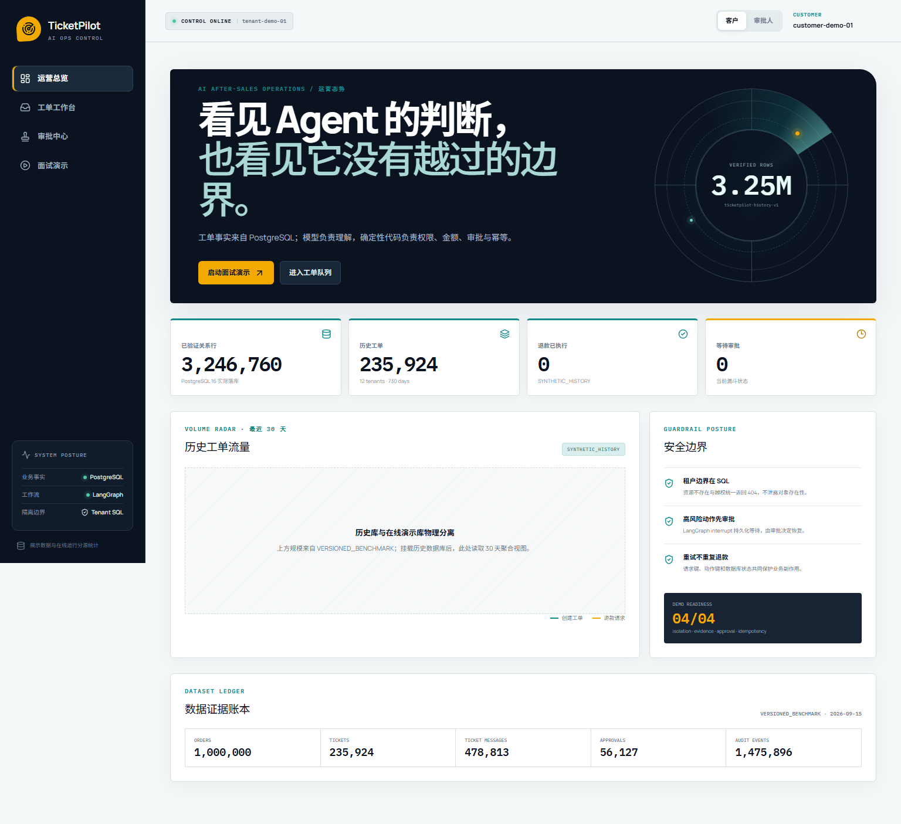
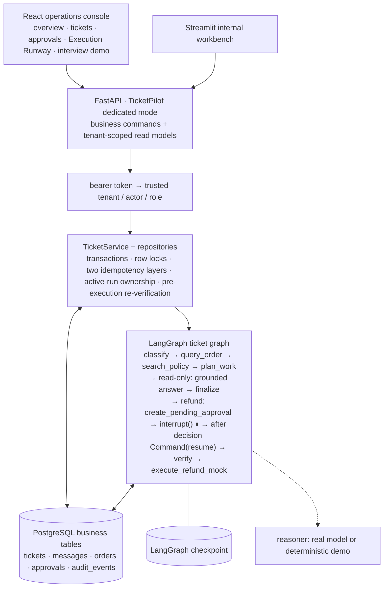
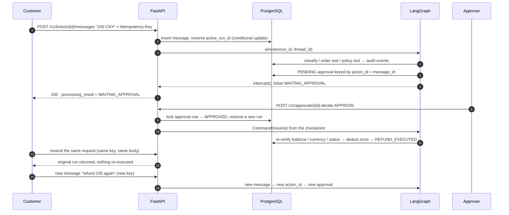
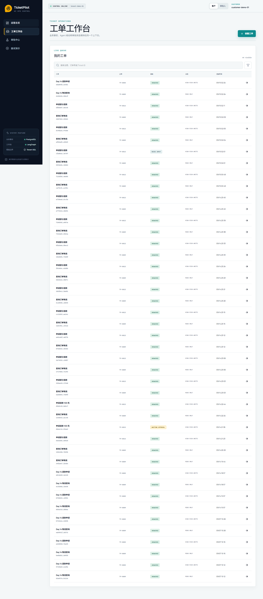
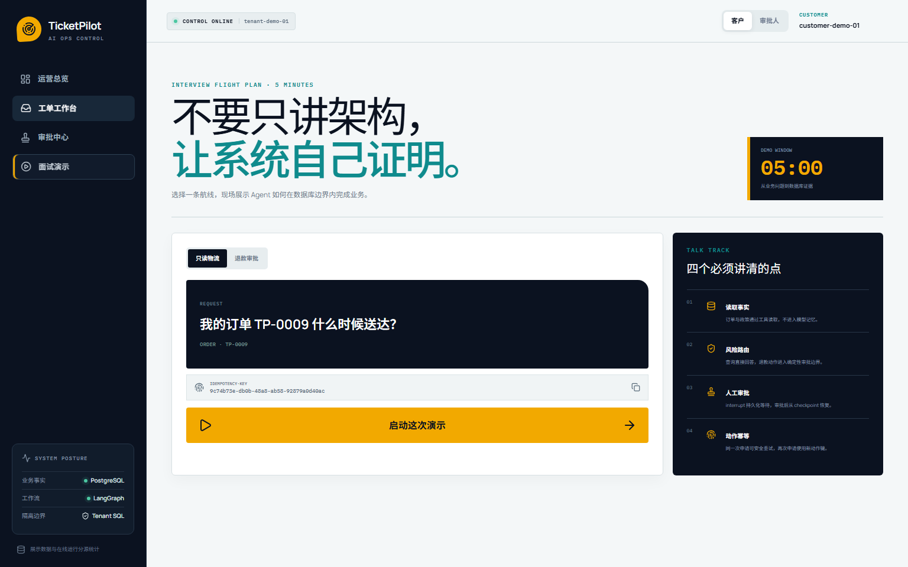

# TicketPilot: a multi-tenant after-sales support agent with human-approved refunds

English | [简体中文](README.zh-CN.md)

> Built on the MIT-licensed [`agent-service-toolkit`](https://github.com/JoshuaC215/agent-service-toolkit).
> **The model understands language; deterministic code, PostgreSQL and a human approver own permissions, state and side effects.**

`React 19 · TypeScript · React Router 7 · FastAPI · LangGraph · PostgreSQL · Redis (optional) · Docker Compose · Playwright`



## The problem

Customers ask about shipping, policies and refunds in natural language. Letting an LLM act on the order system directly creates three risks: reading another tenant's orders, treating "I mentioned a refund" as "I requested a refund", and double refunds caused by retries or concurrent messages. TicketPilot hands those risks to code and database constraints instead of prompts:

- **Authorization** – a bearer token resolves to a trusted `tenant / actor / role`; cross-tenant or cross-customer access is a uniform 404, and the dedicated mode unmounts every generic agent route from upstream.
- **Intent boundaries** – a refund proposal is only created when the model returns an explicit amount or an explicit full-refund flag; a missing order, missing amount, negated refund or order conflict ends in "waiting for input" or a plain answer, never an approval.
- **Side effects** – refunds always pause for human approval (LangGraph `interrupt()`, resumed from the checkpoint after the decision) and re-verify order facts before executing. Two idempotency layers separate "retry of the same request" from "asking for the same amount again".

## The main path in 30 seconds

```text
customer message ──► POST /v1/tickets (Idempotency-Key)
                       │  token → tenant/actor/role; same key + same body → original ticket/run
                       ▼
             reserve the active run (conditional update: one executor per ticket)
                       ▼
   LangGraph: classify → order tool → policy retrieval → plan
                       │
     ├─ read-only  ──► grounded answer (ANSWERED) or explicit missing-evidence / dependency failure
     ├─ missing info ─► WAITING_INFORMATION (NEEDS_INPUT); the next message fills the slot
     └─ refund     ──► PENDING approval row → interrupt() (WAITING_APPROVAL)
                                 ▼
               approver POST /v1/approvals/{id}:decide
                                 ▼
        Command(resume) from checkpoint → re-verify order → mock refund once → audit
```

Ticket status (`NEW / PROCESSING / WAITING_INFORMATION / WAITING_APPROVAL / RESOLVED / FAILED`) and the per-run processing result (`ANSWERED / NEEDS_INPUT / WAITING_APPROVAL / DEPENDENCY_FAILED / INSUFFICIENT_EVIDENCE / PROCESSING_FAILED`) are separate dimensions with a database check on legal pairs, so an order-service timeout can never be reported as "order not found" or "resolved".

## Architecture



Approval sequence (the last four steps show retry vs. a new same-amount request):



## What I built vs. what upstream provides

| Layer | Upstream `agent-service-toolkit` | Added here |
| --- | --- | --- |
| Service | FastAPI service, agent registry, SSE streaming, Streamlit chat UI, Docker Compose | `TICKETPILOT_ENABLED` dedicated mode: only `/v1` business routes, `/info`, `/health`; generic routes answer 404 |
| Workflow | `interrupt()` / `Command(resume)` samples, PostgreSQL checkpointer | Ticket graph: classification, order/policy tools, risk routing, approval pause/resume, result semantics |
| Persistence | checkpoint and store wiring | Separate business pool, 8 versioned migrations, five constrained business tables, plus streaming `COPY` and quality checks for million-order history |
| Identity | optional bearer check | `TICKETPILOT_AUTH_TOKENS` → `RequestPrincipal`; ownership pushed into SQL; role checks |
| Reliability | — | request idempotency, refund-action idempotency, active-run ownership, approval replay, pre-execution re-verification |
| Evaluation | — | 120-case Chinese diagnostic set, bounded-concurrency runner, Wilson interval, per-scenario metrics, confusion matrix and reproducible real-model reports |
| Demo | generic chat page | React/TypeScript operations console and Execution Runway; Streamlit retained as an internal workbench; API and browser golden paths |

See [`docs/CONTRIBUTION_MAP.md`](docs/CONTRIBUTION_MAP.md) for the contribution boundary and [`UPSTREAM.md`](UPSTREAM.md) for provenance. Upstream capabilities are not claimed as my own work.

## Reliability work, with evidence

| Item | Problem | Design | Evidence |
| --- | --- | --- | --- |
| P0-A route isolation | `/v1` was authorized, but upstream `history / threads / invoke / stream` could still reach the same checkpoints | dedicated mode mounts no generic routes and loads no generic agents; 401 without identity, 404 across tenants, rejected requests write nothing | `tests/service/test_ticketpilot_isolation.py`, `tests/ticketpilot/test_api_isolation.py` |
| P0-B refund semantics | a "refund" keyword overrode the model's classification and a missing amount defaulted to the full balance | trust only structured output; propose only with an explicit amount or full-refund flag; bounded multi-turn slot filling via `pending_request`; cancellations and topic changes do not inherit | `tests/ticketpilot/test_refund_intent.py`, `test_workflow_graph.py` |
| P0-C run ownership | with two interleaved messages the graph read "the latest message" instead of its trigger; a late failure of an old run could overwrite the new state | bind message ↔ run, reserve `active_run_id` in a short transaction, run the long task outside it, check ownership on every write; a new message during execution gets 409 | `tests/ticketpilot/test_run_ownership.py` (barrier-driven interleaving) |
| P0-D two idempotency layers | `ticket + order + amount` could not tell a retry from a second refund | request layer: `tenant + actor + Idempotency-Key` + body digest; action layer: the triggering message id is the `action_id`; unique constraints in the database | `tests/ticketpilot/test_ticket_repository.py`, `migrations/0005` |
| P1-A result semantics | timeouts, missing evidence and missing input all ended as `RESOLVED` | six `processing_result` values separate from ticket status, checked in the database, surfaced in the UI | `migrations/0006`, `tests/ticketpilot/test_workflow_graph.py` |

Not claimed: exactly-once across a real payment provider (the refund is a mock; a real one needs a provider idempotency key, an outbox and reconciliation) and automatic takeover after a hard kill (a claimed run needs a recovery mechanism).

## Million-order synthetic history and concurrency evidence

The default history manifest was actually loaded into PostgreSQL 16: **1,000,000 orders, 235,924 tickets, 478,813 messages, 56,127 approvals and 1,475,896 audit events — 3,246,760 related rows** across 12 tenants and 730 days. The generator streams 20,000-order batches into foreign-key-ordered `COPY` transactions; the load took 196.360 s and all 21 cross-table quality checks passed. A dataset fingerprint makes reruns idempotent: the second load stage detected the registered data in 0.560 s and inserted nothing. Synthetic history and records produced by real Service/LangGraph runs are explicitly separated.

To reproduce the generator safely, start with `uv run python scripts/ticketpilot_history_data.py --orders 1000 --dry-run`. Loading the full manifest needs a dedicated local PostgreSQL database passed through `--dsn`; the command also accepts `--output` for a local JSON report. Do not target a production database.

Two workloads keep their measurement boundaries explicit. The full `TicketService → LangGraph → PostgreSQL` path ran 200 requests at concurrency 1/10/30/100 with no failures; 100 identical creates produced one ticket/run and 100 identical approvals executed one mock refund. Throughput stopped scaling after concurrency 10 and P95 reached 9.515 s at concurrency 100, exposing a real capacity boundary.

A separate HTTP read test traversed `Nginx → Uvicorn/FastAPI → Bearer → PostgreSQL`: 5,000/5,000 responses were 200 across concurrency 1/20/50/100/200. The local peak was about 199 req/s at concurrency 20; at 200 it was about 172 req/s with 1.524 s P95. A later 3,000-request test at 1,000 client connections returned 3,000/3,000 HTTP 200, but throughput fell to 180.58 req/s and P95 rose to 7.184 s. Both tests exclude LLM and writes; neither is Agent throughput or a production SLA. The read workload is implemented by `scripts/ticketpilot_http_benchmark.py`.

## Policy retrieval cache

The optional Redis wrapper caches applicable policy IDs for each tenant, corpus/version, query and retrieval configuration; citations are rebuilt from the current policy corpus. Short negative TTLs, bounded waiting and owner-checked leases reduce duplicate cold retrievals across workers. Redis failures fall back to direct retrieval, while the refund and approval facts remain in PostgreSQL. Run it with `docker compose -f compose.yaml -f docker/compose.ticketpilot-demo.yaml -f docker/compose.ticketpilot-redis.yaml up -d --build`; omit the Redis overlay to disable the cache. `TICKETPILOT_REDIS_URL` and cache limits are documented in `.env.example`. The cache replay script is `scripts/evaluate_ticketpilot_cache.py`; its local output reports are intentionally excluded from Git.

## Real-model evaluation

`scripts/evaluate_ticketpilot_classification.py` evaluates the real `LangChainTicketReasoner` on intent classification and slot extraction. A sample counts as correct only when all four fields (intent, order reference, explicit amount, full-refund flag) match; the report records model, temperature, data and code hashes, per-sample output and latency.

| Samples | Prompt v1 | Prompt v2 |
| --- | ---: | ---: |
| 18-sample dev set | 15/18 | 18/18 |
| 6 targeted transfer samples | 4/6 | 5/6 |

On 2026-09-15, a new 120-case diagnostic set (8 scenario families; 90 hard and 30 medium cases) produced **101/120 strict exact matches = 84.17%** with a Wilson 95% CI of **76.59%–89.62%**. Three call/schema errors remain in the denominator. The concentrated weakness was colloquial full-refund intent at 2/15.

The investigation found that the OpenAI-compatible wire schema did not require every output field, so the provider could omit `full_refund_requested` and a local default silently became `false`. Requiring every field and removing defaults was followed by a declared 45-case targeted regression: **44/45 = 97.78%**, zero call errors, and full-refund improved from **2/15 to 15/15** while negation/cancellation stayed 15/15. This targeted score is not presented as a post-fix score for all 120 cases. The versioned input set is `data/ticketpilot/evals/classification_eval_v2.json`; local result reports are excluded from Git.

One integration finding: the OpenAI-compatible provider rejected the JSON Schema regex generated for `Decimal` before the model ever answered; the wire schema now uses `number | null` and Pydantic still validates positivity, two decimals and the upper bound after the response.

## Quickstart

One-command demo stack (deterministic reasoner, no model API key needed):

```sh
cp .env.example .env            # keep at least the POSTGRES_* defaults
docker compose -f compose.yaml -f docker/compose.ticketpilot-demo.yaml up -d --build
```

Open `http://localhost:3000` for the React operations console. Its demo route offers logistics, refund approval and policy RAG scenarios; the policy route does not require an order number. The deterministic demo does not call a paid model. `http://localhost:8501` remains the internal Streamlit workbench.

Automated acceptance:

```sh
uv run python scripts/ticketpilot_demo.py                          # API golden path
uv run --with playwright python scripts/ticketpilot_ui_e2e.py      # browser golden path, regenerates screenshots
```

## Screenshots

| Operations overview | Ticket queue | Idempotency interview demo |
| --- | --- | --- |
|  |  |  |

The responsive React console is the interview-facing product surface; the existing `llm-*` and deterministic Streamlit captures remain as internal workflow evidence in [`media/ticketpilot/`](media/ticketpilot/).

## Tests

```sh
uv sync --frozen
uv run pytest                                  # default: no PostgreSQL required
uv run pytest tests/ticketpilot --run-docker   # needs the compose PostgreSQL
uv run ruff check src tests scripts
```

Results on 2026-09-15, Windows 11 / Python 3.12: default suite `297 passed, 39 skipped`; PostgreSQL-backed TicketPilot suite `114 passed`; service isolation 6 passed; the React browser check has zero console errors, a 390 px no-overflow viewport and a same-key retry returning the same ticket/run. The selections overlap and must not be summed.

## Layout

```text
src/ticketpilot/             business code: api / services / repositories / workflow_repository / graph / tools / reasoning / schemas / domain
src/ticketpilot_streamlit.py demo workbench
src/client/ticketpilot.py    business API client
frontend/                    React Router console: overview / tickets / approvals / interview demo
migrations/ticketpilot/      versioned SQL migrations 0001–0008
data/ticketpilot/            synthetic order/history manifests, policy corpus, classification eval sets
scripts/                     API/browser acceptance, million-history load, scale/concurrency and real-model evaluation
tests/ticketpilot/           API, isolation, repository, run ownership, refund semantics, graph and scorer tests
docs/                        public architecture and contribution attribution only
```

## Upstream toolkit and generic mode

With `TICKETPILOT_ENABLED=false` the repository is still the full upstream toolkit (multiple agents, SSE streaming, AG-UI, a RAG sample, voice); see the [upstream README](https://github.com/JoshuaC215/agent-service-toolkit#readme). Do not expose an instance that holds TicketPilot data in generic mode: the dedicated mode is an application boundary built by unmounting routes, not physical isolation of historical checkpoints.

```sh
uv sync --frozen
uv run python src/run_service.py          # FastAPI on 8080
uv run streamlit run src/streamlit_app.py # Streamlit on 8501
docker compose watch                      # or: full stack with live reload
```

## License

MIT, with the upstream copyright notice retained; see [`LICENSE`](LICENSE) and [`UPSTREAM.md`](UPSTREAM.md). All demo data is synthetic.
