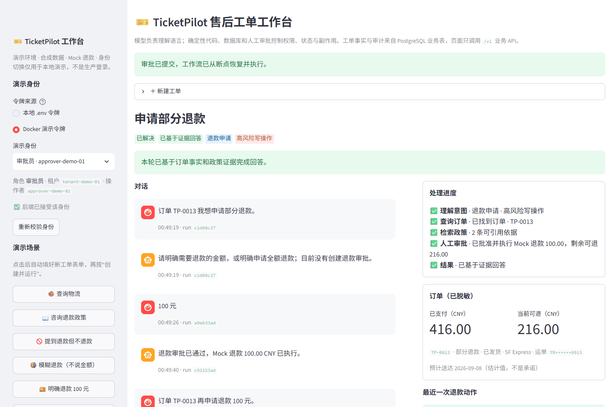
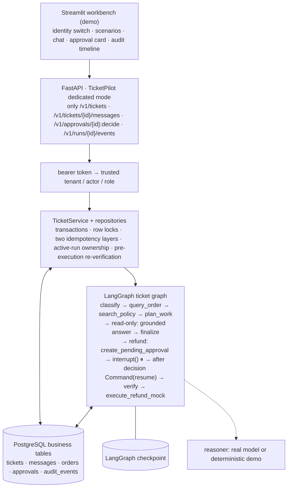
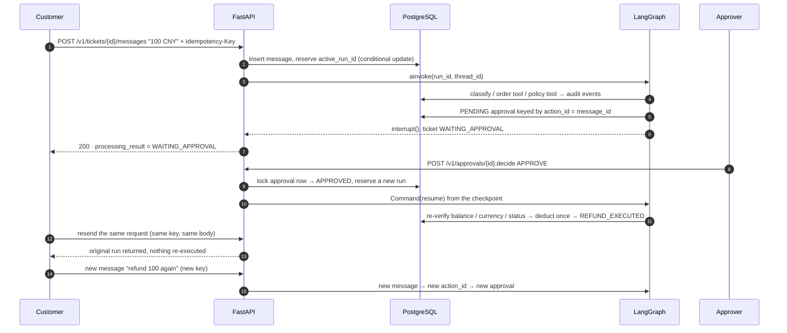
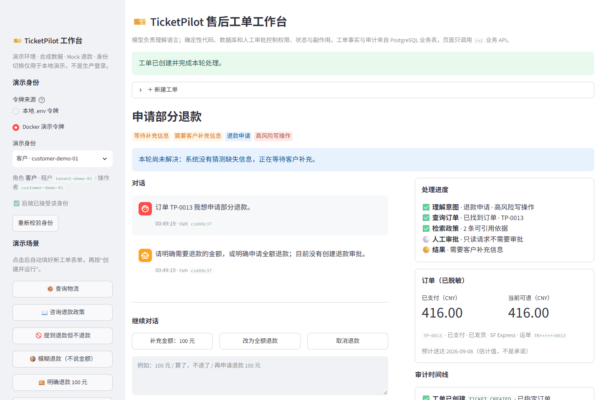
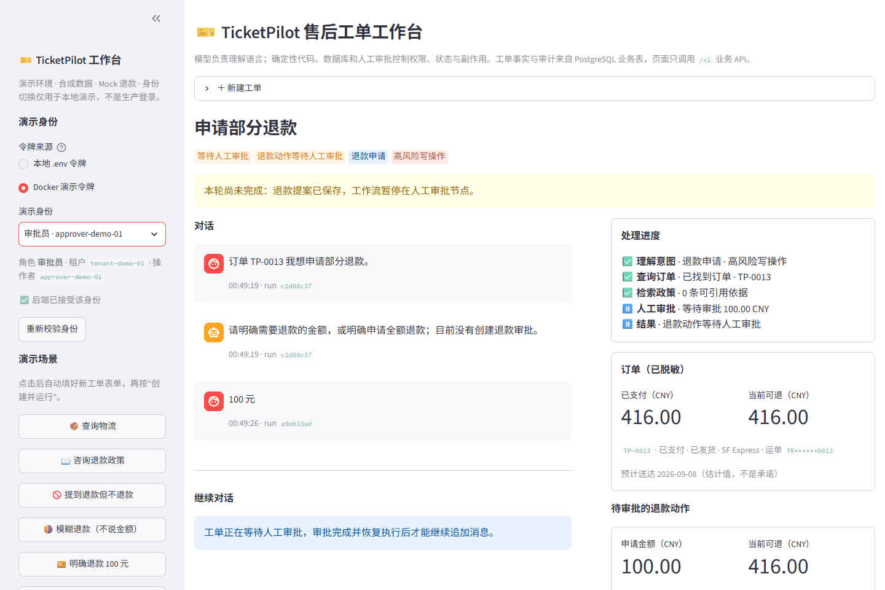
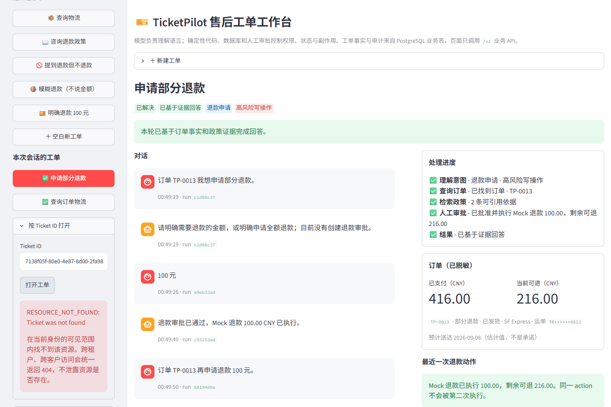

# TicketPilot: a multi-tenant after-sales support agent with human-approved refunds

English | [简体中文](README.zh-CN.md)

> Built on the MIT-licensed [`agent-service-toolkit`](https://github.com/JoshuaC215/agent-service-toolkit).
> **The model understands language; deterministic code, PostgreSQL and a human approver own permissions, state and side effects.**

`Python 3.12 · FastAPI · LangGraph · PostgreSQL · Streamlit · Docker Compose · Playwright`



## The problem

Customers ask about shipping, policies and refunds in natural language. Letting an LLM act on the order system directly creates three risks: reading another tenant's orders, treating "I mentioned a refund" as "I requested a refund", and double refunds caused by retries or concurrent messages. TicketPilot hands those risks to code and database constraints instead of prompts:

- **Authorization** – a bearer token resolves to a trusted `tenant / actor / role`; cross-tenant or cross-customer access is a uniform 404, and the dedicated mode unmounts every generic agent route from upstream.
- **Intent boundaries** – a refund proposal is only created when the model returns an explicit amount or an explicit full-refund flag; a missing order, missing amount, negated refund or order conflict ends in "waiting for input" or a plain answer, never an approval.
- **Side effects** – refunds always pause for human approval (LangGraph `interrupt()`, resumed from the checkpoint after the decision) and re-verify order facts before executing. Two idempotency layers separate "retry of the same request" from "asking for the same amount again".

## The main path in 30 seconds

```text
customer message ──► POST /v1/tickets (Idempotency-Key)
                       │  token → tenant/actor/role; same key + same body → original ticket/run
                       ▼
             reserve the active run (conditional update: one executor per ticket)
                       ▼
   LangGraph: classify → order tool → policy retrieval → plan
                       │
     ├─ read-only  ──► grounded answer (ANSWERED) or explicit missing-evidence / dependency failure
     ├─ missing info ─► WAITING_INFORMATION (NEEDS_INPUT); the next message fills the slot
     └─ refund     ──► PENDING approval row → interrupt() (WAITING_APPROVAL)
                                 ▼
               approver POST /v1/approvals/{id}:decide
                                 ▼
        Command(resume) from checkpoint → re-verify order → mock refund once → audit
```

Ticket status (`NEW / PROCESSING / WAITING_INFORMATION / WAITING_APPROVAL / RESOLVED / FAILED`) and the per-run processing result (`ANSWERED / NEEDS_INPUT / WAITING_APPROVAL / DEPENDENCY_FAILED / INSUFFICIENT_EVIDENCE / PROCESSING_FAILED`) are separate dimensions with a database check on legal pairs, so an order-service timeout can never be reported as "order not found" or "resolved".

## Architecture



Approval sequence (the last four steps show retry vs. a new same-amount request):



## What I built vs. what upstream provides

| Layer | Upstream `agent-service-toolkit` | Added here |
| --- | --- | --- |
| Service | FastAPI service, agent registry, SSE streaming, Streamlit chat UI, Docker Compose | `TICKETPILOT_ENABLED` dedicated mode: only `/v1` business routes, `/info`, `/health`; generic routes answer 404 |
| Workflow | `interrupt()` / `Command(resume)` samples, PostgreSQL checkpointer | Ticket graph: classification, order/policy tools, risk routing, approval pause/resume, result semantics |
| Persistence | checkpoint and store wiring | Separate business pool, 6 versioned migrations, tickets/messages/orders/approvals/audit tables with constraints |
| Identity | optional bearer check | `TICKETPILOT_AUTH_TOKENS` → `RequestPrincipal`; ownership pushed into SQL; role checks |
| Reliability | — | request idempotency, refund-action idempotency, active-run ownership, approval replay, pre-execution re-verification |
| Evaluation | — | 18 + 6 synthetic Chinese samples, deterministic scorer, reproducible real-model evaluation script |
| Demo | generic chat page | role-aware workbench (identity switch, scenario buttons, approval card, audit timeline), API and browser golden-path scripts |

See [`docs/CONTRIBUTION_MAP.md`](docs/CONTRIBUTION_MAP.md) for the full attribution and [`UPSTREAM.md`](UPSTREAM.md) for provenance. Upstream capabilities are not claimed as my own work.

## Reliability work, with evidence

| Item | Problem | Design | Evidence |
| --- | --- | --- | --- |
| P0-A route isolation | `/v1` was authorized, but upstream `history / threads / invoke / stream` could still reach the same checkpoints | dedicated mode mounts no generic routes and loads no generic agents; 401 without identity, 404 across tenants, rejected requests write nothing | `tests/service/test_ticketpilot_isolation.py`, `tests/ticketpilot/test_api_isolation.py` |
| P0-B refund semantics | a "refund" keyword overrode the model's classification and a missing amount defaulted to the full balance | trust only structured output; propose only with an explicit amount or full-refund flag; bounded multi-turn slot filling via `pending_request`; cancellations and topic changes do not inherit | `tests/ticketpilot/test_refund_intent.py`, `test_workflow_graph.py` |
| P0-C run ownership | with two interleaved messages the graph read "the latest message" instead of its trigger; a late failure of an old run could overwrite the new state | bind message ↔ run, reserve `active_run_id` in a short transaction, run the long task outside it, check ownership on every write; a new message during execution gets 409 | `tests/ticketpilot/test_run_ownership.py` (barrier-driven interleaving) |
| P0-D two idempotency layers | `ticket + order + amount` could not tell a retry from a second refund | request layer: `tenant + actor + Idempotency-Key` + body digest; action layer: the triggering message id is the `action_id`; unique constraints in the database | `tests/ticketpilot/test_ticket_repository.py`, `migrations/0005` |
| P1-A result semantics | timeouts, missing evidence and missing input all ended as `RESOLVED` | six `processing_result` values separate from ticket status, checked in the database, surfaced in the UI | `migrations/0006`, `tests/ticketpilot/test_workflow_graph.py` |

Not claimed: exactly-once across a real payment provider (the refund is a mock; a real one needs a provider idempotency key, an outbox and reconciliation) and automatic takeover after a hard kill (a claimed run needs a recovery mechanism).

## Real-model evaluation

`scripts/evaluate_ticketpilot_classification.py` evaluates the real `LangChainTicketReasoner` on intent classification and slot extraction. A sample counts as correct only when all four fields (intent, order reference, explicit amount, full-refund flag) match; the report records model, temperature, data and code hashes, per-sample output and latency.

| Samples | Prompt v1 | Prompt v2 |
| --- | ---: | ---: |
| 18-sample dev set | 15/18 | 18/18 |
| 6 targeted transfer samples | 4/6 | 5/6 |

Single run on 2026-09-14 with `qwen3.7-flash`, temperature 0.5, about 13–15 s per sample. v2 changes only the system prompt (explicit full-refund flag, known-order inheritance, bare-order-number routing); the three original errors are fixed with no regressions, while one paraphrase of "refund everything I paid" still misses the flag and is kept as a known limitation. These are dev-set numbers, not production accuracy. Details in [`data/ticketpilot/evals/README.md`](data/ticketpilot/evals/README.md).

One integration finding: the OpenAI-compatible provider rejected the JSON Schema regex generated for `Decimal` before the model ever answered; the wire schema now uses `number | null` and Pydantic still validates positivity, two decimals and the upper bound after the response.

## Quickstart

One-command demo stack (deterministic reasoner, no model API key needed):

```sh
cp .env.example .env            # keep at least the POSTGRES_* defaults
docker compose -f compose.yaml -f docker/compose.ticketpilot-demo.yaml up -d --build
```

Open `http://localhost:8501` and follow the five-minute script in [`docs/TICKETPILOT_DEMO.md`](docs/TICKETPILOT_DEMO.md) (Chinese). Real-model mode (`TICKETPILOT_REASONER_MODE=llm` with `DEFAULT_MODEL` pointing at your provider) is described in section 2 of the same document.

Automated acceptance:

```sh
uv run python scripts/ticketpilot_demo.py                          # API golden path
uv run --with playwright python scripts/ticketpilot_ui_e2e.py      # browser golden path, regenerates screenshots
```

## Screenshots

| Vague refund → waiting for input | Approver view | Cross-tenant lookup → 404 |
| --- | --- | --- |
|  |  |  |

All screenshots live in [`media/ticketpilot/`](media/ticketpilot/) and are produced by `scripts/ticketpilot_ui_e2e.py`. The UI is in Chinese.

## Tests

```sh
uv sync --frozen
uv run pytest                                  # default: no PostgreSQL required
uv run pytest tests/ticketpilot --run-docker   # needs the compose PostgreSQL
uv run ruff check src tests scripts
```

Results on 2026-09-14, Windows 11 / Python 3.12: default suite `287 passed, 39 skipped`; PostgreSQL-backed TicketPilot suite `104 passed` (35 of them run only with `--run-docker`); service isolation 8 passed; browser golden path 8/8 steps in about 55 s. The numbers come from different test selections and must not be summed.

## Layout

```text
src/ticketpilot/             business code: api / services / repositories / workflow_repository / graph / tools / reasoning / schemas / domain
src/ticketpilot_streamlit.py demo workbench
src/client/ticketpilot.py    business API client
migrations/ticketpilot/      versioned SQL migrations 0001–0006
data/ticketpilot/            synthetic order manifest, synthetic policy corpus, classification eval sets
scripts/                     ticketpilot_demo.py (API acceptance), ticketpilot_ui_e2e.py (browser acceptance), evaluate_ticketpilot_classification.py
tests/ticketpilot/           API, isolation, repository, run ownership, refund semantics, graph and scorer tests
docs/                        ARCHITECTURE, CONTRIBUTION_MAP, DATASET_STRATEGY, TICKETPILOT_DEMO, adr/
```

## Upstream toolkit and generic mode

With `TICKETPILOT_ENABLED=false` the repository is still the full upstream toolkit (multiple agents, SSE streaming, AG-UI, a RAG sample, voice); see the [upstream README](https://github.com/JoshuaC215/agent-service-toolkit#readme). Do not expose an instance that holds TicketPilot data in generic mode: the dedicated mode is an application boundary built by unmounting routes, not physical isolation of historical checkpoints.

```sh
uv sync --frozen
uv run python src/run_service.py          # FastAPI on 8080
uv run streamlit run src/streamlit_app.py # Streamlit on 8501
docker compose watch                      # or: full stack with live reload
```

## License

MIT, with the upstream copyright notice retained; see [`LICENSE`](LICENSE) and [`UPSTREAM.md`](UPSTREAM.md). All demo data is synthetic.
