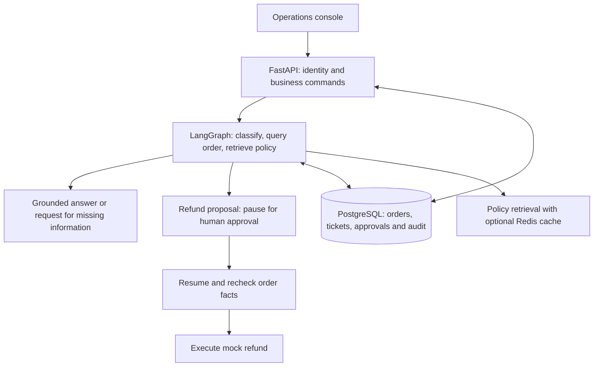
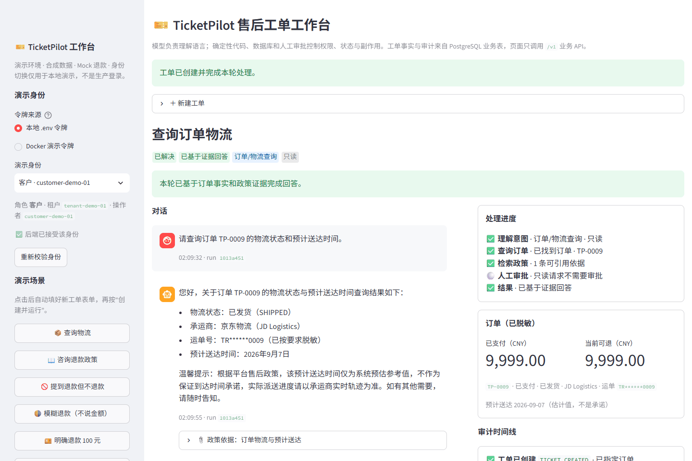

# TicketPilot

English | [简体中文](README.zh-CN.md)

A multi-tenant after-sales support agent for order queries, policy retrieval and human-approved refunds. TicketPilot combines a React operations console, a LangGraph workflow and PostgreSQL-backed business controls.

`React · TypeScript · FastAPI · LangGraph · PostgreSQL · Redis · Docker Compose`

## Capabilities

| Capability | Behavior |
| --- | --- |
| Order and shipping queries | Answers from tenant-scoped order facts, with tracking details masked |
| Policy retrieval | Retrieves applicable passages and attaches citations; supports BM25, dense, hybrid and reranking strategies |
| Multi-turn requests | Collects missing order or refund information across messages |
| Refund approval | Pauses for a human decision, then rechecks the order before executing a mock refund |
| Tenant and role isolation | Restricts reads and writes by tenant, customer ownership and role; unauthorized resources return a uniform 404 |
| Idempotent execution | Separates retries from new refund actions; concurrent retries share the original ticket/run |
| Operations console | Displays tickets, approvals, processing results, execution events and workload summaries |
| Retrieval cache | Uses optional Redis caching with tenant/version isolation and direct-retrieval fallback |

## Workflow


```mermaid
flowchart TD
    UI["Operations console"] --> API["FastAPI: identity and business commands"]
    API --> G["LangGraph: classify, query order, retrieve policy"]
    G --> R["Grounded answer or request for missing information"]
    G --> A["Refund proposal: pause for human approval"]
    A --> V["Resume and recheck order facts"]
    V --> F["Execute mock refund"]
    API <--> DB[("PostgreSQL: orders, tickets, approvals and audit")]
    G <--> DB
    G --> C["Policy retrieval with optional Redis cache"]
```

Ticket status and processing result are tracked separately. Missing evidence, dependency failure and missing customer input remain distinguishable from a completed answer.

## Feature preview

Order query with policy citations, captured from a real-model run in the support workbench:



## Validation results

| Workload | Result |
| --- | --- |
| Synthetic history load | 1,000,000 orders and 3,246,760 related rows across 12 tenants; 21 cross-table checks passed |
| Concurrent retry checks | 100 identical creates produced one ticket/run; 100 identical approvals executed one mock refund |
| HTTP read workload | 5,000/5,000 successful responses; local peak about 199 requests/s at concurrency 20 |
| Chinese intent and slot evaluation | 101/120 strict matches, 84.17%, on a 120-case diagnostic set |
| Targeted schema regression | 44/45 strict matches, 97.78%, on a separate 45-case regression set |
| Automated checks | Default Python: 325 passed, 44 skipped; PostgreSQL: 147 passed; frontend: 4 tests passed |

Model evaluation used `qwen3.7-flash`; a strict match requires intent, order reference, amount and full-refund flag to agree. The 45-case result is a targeted regression, not a new score for all 120 cases. HTTP read measurements exclude model calls and writes. Test selections overlap and must not be added together.

## Quickstart

Requires Docker Compose. Copy the environment template, then add `TICKETPILOT_RETRIEVAL_STRATEGY=bm25` to `.env` for retrieval without embedding-model downloads.

```sh
cp .env.example .env
docker compose -f compose.yaml -f docker/compose.ticketpilot-demo.yaml up -d --build
```

- Operations console: <http://localhost:3000>
- API health: <http://localhost:8080/health>
- Support workbench: <http://localhost:8501>

The default demo uses a deterministic reasoner and synthetic orders, without a model API key. Refunds are mock actions. Real-model configuration is available in [`.env.example`](.env.example).

## Verification

```sh
uv sync --frozen --extra retrieval
uv run pytest
uv run pytest tests/ticketpilot --run-docker
uv run python scripts/ticketpilot_demo.py
```

PostgreSQL and API checks require the running demo stack. GitHub Actions also checks Python 3.12–3.14, types, formatting, the frontend build, Docker integration and the authenticated HTTPS demo.

## Implementation and license

TicketPilot builds on the MIT-licensed [agent-service-toolkit](https://github.com/JoshuaC215/agent-service-toolkit). Its service and checkpoint infrastructure support the added ticket workflow, tenant-scoped repositories, approval controls, idempotency, retrieval and operations console. The original copyright notice is retained in [LICENSE](LICENSE).
