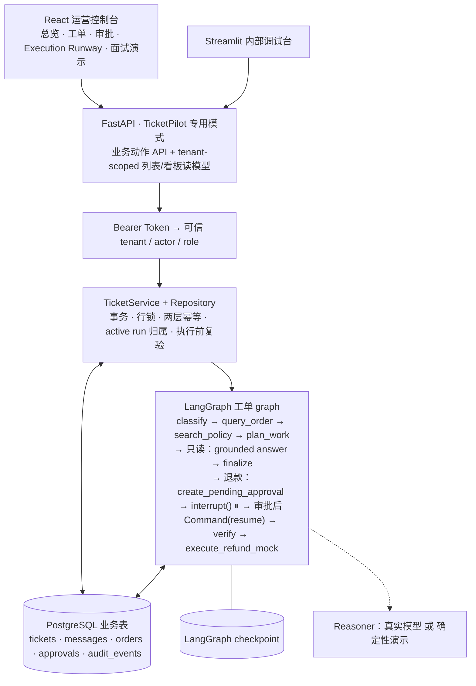
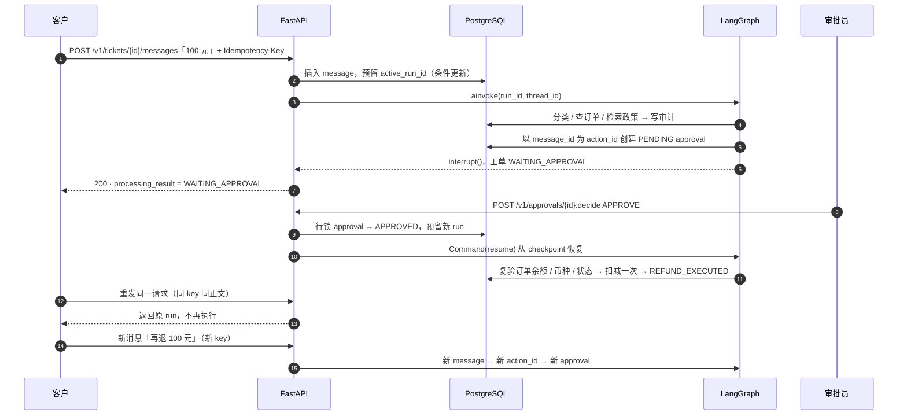
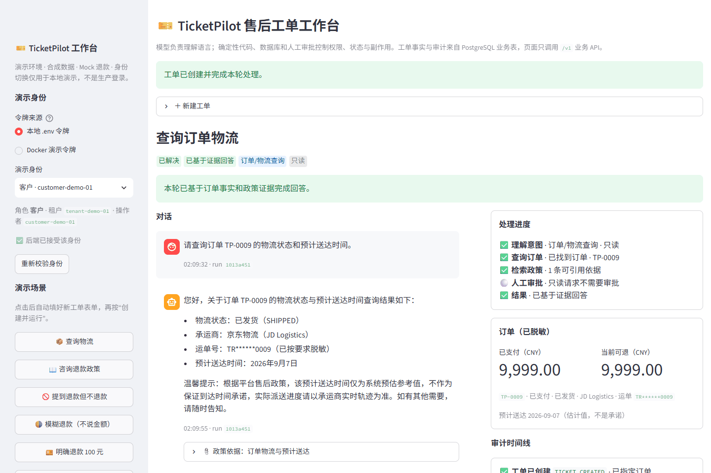

# TicketPilot：多租户 AI 售后工单与退款审批 Agent

[English](README.md) | 简体中文

> 基于开源 [`agent-service-toolkit`](https://github.com/JoshuaC215/agent-service-toolkit)（MIT）二次开发。
> **模型负责理解语言；确定性代码、PostgreSQL 和人工审批控制权限、状态与副作用。**

`React 19 · TypeScript · React Router 7 · FastAPI · LangGraph · PostgreSQL · Docker Compose · Playwright`


## 它解决什么问题

电商售后场景里，客户用自然语言查物流、问政策、申请退款。让大模型直接操作订单系统有三类风险：越权读到别人的订单、把"提到退款"误当成"申请退款"、网络重试或并发导致重复退款。TicketPilot 把这三类风险交给确定性代码和数据库约束，而不是交给提示词：

- **权限**：Bearer Token 解析成可信的 `tenant / actor / role`，跨租户、跨客户访问统一返回 404；专用模式下关闭上游所有通用 Agent 入口。
- **意图边界**：只有模型给出明确金额或明确全额意图才生成退款提案；缺订单号、缺金额、否定退款、订单冲突都进入「等待补充」或普通回答，不创建审批。
- **副作用**：退款必须经过人工审批（LangGraph `interrupt()` 暂停，审批后从 checkpoint 恢复），执行前重新复验订单事实；请求层和业务动作层各有一套幂等，同一次申请重试不重复退款，再次申请相同金额是新动作。

## 30 秒看懂主链路

```text
客户消息 ──► POST /v1/tickets（Idempotency-Key）
              │  Token → tenant/actor/role；同 key 同正文 → 返回原 ticket/run
              ▼
        预留 active run（数据库条件更新，一张工单同一时刻只有一个执行者）
              ▼
   LangGraph：分类意图 → 订单 Tool → 政策检索 → 规划动作
              │
     ├─ 只读问题 ──► 有证据地回答（ANSWERED）或说明缺证据 / 依赖失败
     ├─ 缺信息  ──► WAITING_INFORMATION（NEEDS_INPUT），下一条消息补齐后继续
     └─ 退款   ──► 保存 PENDING 审批 → interrupt() 暂停（WAITING_APPROVAL）
                        ▼
          审批员 POST /v1/approvals/{id}:decide
                        ▼
      Command(resume) 从 checkpoint 恢复 → 复验订单 → Mock 退款一次 → 审计
```

工单状态（`NEW / PROCESSING / WAITING_INFORMATION / WAITING_APPROVAL / RESOLVED / FAILED`）与本轮处理结果（`ANSWERED / NEEDS_INPUT / WAITING_APPROVAL / DEPENDENCY_FAILED / INSUFFICIENT_EVIDENCE / PROCESSING_FAILED`）是两个维度，数据库层约束合法组合：订单服务超时不会被说成"订单不存在"，政策无命中不会被记成"已回答"。

## 架构



审批时序（同一次申请重试与同金额新申请的区别在最后两步）：



## 我做了什么（与上游的边界）

| 层 | 上游 `agent-service-toolkit` 已提供 | 本项目新增 |
| --- | --- | --- |
| 服务框架 | FastAPI 服务、通用 Agent 注册、SSE、Streamlit 聊天 UI、Docker Compose | `TICKETPILOT_ENABLED` 专用模式：只挂载 `/v1` 业务 API、`/info`、`/health`，通用入口返回 404 |
| 工作流 | LangGraph `interrupt()` / `Command(resume)` 示例、PostgreSQL checkpointer | 工单专用 graph：意图分类、订单/政策 Tool、风险路由、退款审批暂停与恢复、结果语义 |
| 持久化 | checkpoint 与 store 接入 | 独立业务连接池、8 个版本化迁移、五张业务表、约束/唯一索引，以及百万级历史的流式 `COPY` 与质量校验 |
| 身份 | 可选 Bearer 校验 | `TICKETPILOT_AUTH_TOKENS` → `RequestPrincipal`；资源归属下推到 SQL；角色权限 |
| 可靠性 | — | 创建/消息请求幂等、退款动作幂等、active run 归属、审批重放、执行前复验 |
| 评测 | — | 18 + 6 条开发/迁移样本，以及 120 条困难中文评测集；精确匹配、分类别 F1、混淆矩阵、Wilson 区间和延迟分位数 |
| 演示 | 通用聊天页 | React/TypeScript 运营控制台与 Execution Runway；Streamlit 保留为内部调试台；API 与浏览器黄金链路脚本 |

完整归属见 [`docs/CONTRIBUTION_MAP.md`](docs/CONTRIBUTION_MAP.md)，来源与许可见 [`UPSTREAM.md`](UPSTREAM.md)。上游能力不是本人从零实现。

## 可靠性设计：五个被验证过的问题

| 编号 | 问题 | 设计 | 证据 |
| --- | --- | --- | --- |
| P0-A 入口隔离 | `/v1` 有权限检查，但上游 `history / threads / invoke / stream` 仍能碰到同一份 checkpoint | 专用模式不挂载通用路由、不加载通用 Agent；无身份 401，越权 404，被拒请求不写任何数据 | `tests/service/test_ticketpilot_isolation.py`、`tests/ticketpilot/test_api_isolation.py` |
| P0-B 退款语义 | 旧逻辑凭"退款"关键词覆盖模型分类，且缺金额时默认全额 | 分类只信结构化输出；只有明确金额或 `full_refund_requested` 才提案；缺信息进入有边界的多轮补充（`pending_request`），取消/换话题不继承 | `tests/ticketpilot/test_refund_intent.py`、`test_workflow_graph.py` |
| P0-C 运行归属 | 两条消息交错时，graph 读到"最新消息"而不是触发它的那条；旧 run 的迟到失败可能覆盖新状态 | 消息与 run 绑定，短事务预留 `active_run_id`，长任务在事务外运行，每次写回校验所有权；执行中再来消息返回 409 | `tests/ticketpilot/test_run_ownership.py`（用同步屏障制造交错） |
| P0-D 两层幂等 | 按 `ticket+order+amount` 判同一动作，无法区分"重试"与"再退一次" | 请求层：`tenant + actor + Idempotency-Key` + 正文摘要；动作层：触发消息 ID 作为 `action_id`，数据库唯一约束 | `tests/ticketpilot/test_ticket_repository.py`、`migrations/0005` |
| P1-A 结果语义 | 超时、无证据、缺信息都被标成 `RESOLVED` | `processing_result` 六种结果与工单状态分离，数据库约束合法组合，界面按结果提示 | `migrations/0006`、`tests/ticketpilot/test_workflow_graph.py` |

明确不宣称：跨真实支付系统的 exactly-once（当前退款是 Mock，真实支付需要支付方幂等键、Outbox 与对账）；进程被强杀后的自动接管（已认领的 run 需要后续恢复机制）。

## 百万级合成历史与并发验证

默认历史 manifest 已在 PostgreSQL 16 实际落库：**1,000,000 订单、235,924 工单、478,813 消息、56,127 审批、1,475,896 审计事件，共 3,246,760 行**，覆盖 12 租户与 730 天。生成器按 20,000 订单流式分批、按外键顺序 `COPY`，196.360 秒完成装载；21 条跨表质量规则全部通过。数据集指纹支持幂等重跑，第二次装载阶段 0.560 秒识别并跳过，行数不增加；一组真实索引查询实际走 `Index Scan`。

另有可执行规模演示：10,000 笔合成订单、10 租户、1,000 个客户、24 个政策片段；12 类业务场景在 10 租户下共 120 次工作流验证。预生成历史以 `SYNTHETIC_HISTORY` 标识，与真实 Service/LangGraph 运行产生的 `LIVE_RUN` 分开统计。详细数据契约、复跑命令、分析视图、耗时与限制见[百万级历史说明](docs/HISTORY_DATASET.md)。

本机做了两种明确分口径的负载实验。完整业务工作流 `TicketService → LangGraph → PostgreSQL` 在 1/10/30/100 并发下各运行 200 次，全部成功；100 次相同请求最终只有一个 ticket/run，100 次相同审批只扣减一次 Mock 金额、只产生一条 `REFUND_EXECUTED`。并发 10 后吞吐不再上升，并发 100 的 P95 达到 9.515 秒，暴露出连接池/checkpoint 写入的容量边界。

另一次 HTTP 只读实验经 `Nginx → Uvicorn/FastAPI → Bearer → PostgreSQL`，在 1/20/50/100/200 并发下各发出 1,000 次请求，5,000/5,000 返回 200；本机峰值约 199 req/s（并发 20），并发 200 时约 172 req/s、P95 1.524 秒。它不包含 LLM 和写动作，不能冒充 Agent 端到端 QPS 或生产 SLA。测量口径和复跑命令见 [规模演示说明](docs/SCALE_DEMO.md)。

## 真实模型评测（M2）

`scripts/evaluate_ticketpilot_classification.py` 对真实 `LangChainTicketReasoner` 的意图分类与字段抽取做可复现评测：四个字段（意图、订单号、明确金额、全额标志）全对才算整条正确，记录模型、temperature、数据与代码哈希、逐条输出与耗时。评测器现支持受控并发，并输出 Wilson 95% 区间、按场景/难度准确率、分类别 precision/recall/F1、混淆矩阵与 P50/P95/P99。

| 样本 | 提示词 v1 | 提示词 v2 |
| --- | ---: | ---: |
| 原 18 条开发集 | 15/18 | 18/18 |
| 6 条针对性迁移样本 | 4/6 | 5/6 |

2026-09-14 单次实验，`qwen3.7-flash`，temperature 0.5，平均每条约 13–15 秒。v2 只改系统提示词（明确全额标志、已知订单继承、纯订单号路由），三处原始错误修复且无退步；「支付的钱全部退给我」仍漏全额标志，保留为已知限制。这是开发集成绩，不是线上准确率。细节见 [`data/ticketpilot/evals/README.md`](data/ticketpilot/evals/README.md)。

2026-09-15 在新建的 120 条困难中文评测集上，`qwen3.7-flash` 四字段严格精确匹配为 **101/120（84.17%，Wilson 95% CI 76.59%–89.62%）**，类别字段 95.83%，订单号 95.00%，金额 97.50%，全额标志 86.67%；3 条调用/结构校验错误保留在分母内。最大弱项集中在全额退款口语化表达（2/15），属于保守漏识别而非越权执行。

排查发现，OpenAI-compatible wire schema 没把所有字段列为必填，provider 会省略 `full_refund_requested`，本地默认值又把缺失掩盖成 `false`。改成所有字段必填并移除默认值后，对受影响与相邻回归族做 45 条定向复测：**44/45（97.78%，Wilson 95% CI 88.43%–99.61%）**、0 调用错误；全额退款从 **2/15 提升到 15/15**，否定/取消仍为 15/15。这里明确不把 45 条定向成绩说成修复后 120 条总分，完整口径见评测文档。

集成时发现的一个真实问题：兼容服务不支持 `Decimal` 生成的 JSON Schema 正则，请求在模型回答前就被 400 拒绝；解决方式是 wire schema 用 `number | null`，返回后仍由 Pydantic 做正数、两位小数和上限校验。

## 快速开始

一键全容器演示（确定性 reasoner，不需要模型 API Key）：

```sh
cp .env.example .env            # 至少保留 POSTGRES_* 默认值
docker compose -f compose.yaml -f docker/compose.ticketpilot-demo.yaml up -d --build
```

打开 `http://localhost:3000` 使用正式 React 运营控制台；`http://localhost:8501` 保留为内部 Streamlit 调试台。启动、身份和页面说明见 [`docs/WEB_CONSOLE.md`](docs/WEB_CONSOLE.md)，五分钟业务脚本见 [`docs/TICKETPILOT_DEMO.md`](docs/TICKETPILOT_DEMO.md)。

自动化验收：

```sh
uv run python scripts/ticketpilot_demo.py                          # API 级黄金链路
uv run --with playwright python scripts/ticketpilot_ui_e2e.py      # 浏览器级黄金链路，并刷新截图
```

## 演示截图

| 工单工作台 | 面试演示航线 |
| --- | --- |
|  |  |

真实模型模式（`qwen3.7-flash`，本机后端）下的物流查询：模型只用订单 Tool 返回的事实和检索到的政策片段作答，运单号已脱敏，回答旁可展开引用。



| 模糊退款进入「等待补充」 | 审批员视角 | 跨租户访问统一 404 |
| --- | --- | --- |
|  |  |  |

全部截图见 [`media/ticketpilot/`](media/ticketpilot/)，由 `scripts/ticketpilot_ui_e2e.py` 自动生成；`llm-*` 前缀的来自真实模型后端，其余来自确定性演示后端。同一条黄金链路在两种后端上都通过（确定性 55 秒，真实模型 108 秒）。

## 测试与验证

```sh
uv sync --frozen
uv run pytest                                  # 默认：不依赖 PostgreSQL
uv run pytest tests/ticketpilot --run-docker   # 需要 compose 里的 PostgreSQL
uv run ruff check src tests scripts
```

2026-09-15 在 Windows 11 / Python 3.12 上的结果：默认全量 `297 passed, 39 skipped`；PostgreSQL 专项 `114 passed`；服务隔离专项 6 passed；React 浏览器验收控制台 0 错误、390px 无横向溢出，同 key 重试返回相同 ticket/run。数字来自有重叠的不同测试集合，不能相加。

## 目录

```text
src/ticketpilot/            业务代码：api / services / repositories / workflow_repository / graph / tools / reasoning / schemas / domain
frontend/                   React Router 运营控制台：总览 / 工单 / 审批 / 面试演示
src/ticketpilot_streamlit.py 内部调试工作台
src/client/ticketpilot.py   业务 API 客户端
migrations/ticketpilot/     0001–0008 版本化 SQL 迁移
data/ticketpilot/           合成订单/历史 manifest、政策语料、分类评测集
scripts/                    API/浏览器验收、百万历史装载、规模并发与真实模型评测脚本
tests/ticketpilot/          API、隔离、仓储、并发归属、退款语义、graph、评测器测试
docs/                       ARCHITECTURE、CONTRIBUTION_MAP、DATASET_STRATEGY、TICKETPILOT_DEMO、adr/
```

## 文档

- [`docs/TICKETPILOT_DEMO.md`](docs/TICKETPILOT_DEMO.md)：启动、身份、五分钟演示脚本、自动化验收
- [`docs/WEB_CONSOLE.md`](docs/WEB_CONSOLE.md)：React 运营控制台架构、启动与页面说明
- [`docs/ARCHITECTURE.md`](docs/ARCHITECTURE.md)：架构原则、状态机、数据模型、审批与恢复设计
- [`docs/CONTRIBUTION_MAP.md`](docs/CONTRIBUTION_MAP.md)：上游能力 / 个人贡献 / 明确不做
- [`docs/DATASET_STRATEGY.md`](docs/DATASET_STRATEGY.md)：合成数据来源与许可
- [`docs/HISTORY_DATASET.md`](docs/HISTORY_DATASET.md)：百万级关系数据、装载、质量规则与分析视图
- [`docs/adr/0001-ticketpilot-scope.md`](docs/adr/0001-ticketpilot-scope.md)：范围决策记录
- [`data/ticketpilot/evals/README.md`](data/ticketpilot/evals/README.md)：评测契约与实验记录

## 上游工具包与通用模式

`TICKETPILOT_ENABLED=false` 时仓库仍是完整的上游 Agent 服务工具包：多 Agent、流式 SSE、AG-UI、RAG 示例、语音等，用法见[上游 README](https://github.com/JoshuaC215/agent-service-toolkit#readme)。不要把保存了 TicketPilot 数据的实例切回通用模式对外开放：专用模式是通过关闭通用入口实现的应用边界，没有物理隔离历史 checkpoint。

通用开发方式（也适用于本地运行 TicketPilot 后端）：

```sh
uv sync --frozen
uv run python src/run_service.py          # FastAPI，默认 8080
uv run streamlit run src/streamlit_app.py # Streamlit，默认 8501
docker compose watch                      # 或者：全容器 + 源码热更新
```

## 许可证

MIT，保留上游原始版权声明，见 [`LICENSE`](LICENSE) 与 [`UPSTREAM.md`](UPSTREAM.md)。所有演示数据均为合成数据，不含真实客户信息。
