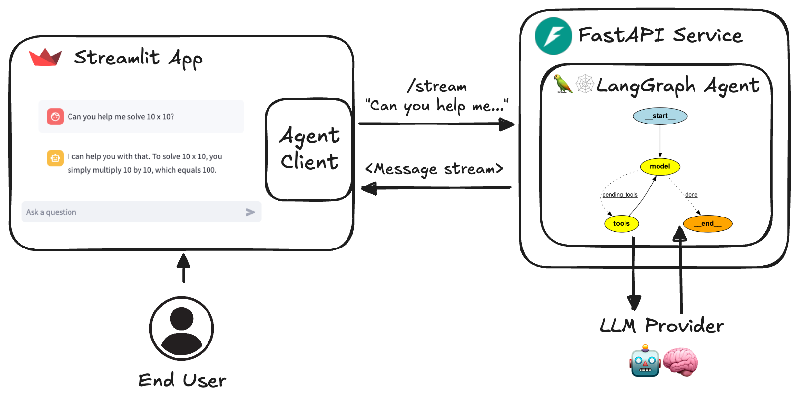

# 🧰 AI Agent 服务工具包

[English](README.md) | 简体中文

[](https://github.com/JoshuaC215/agent-service-toolkit/actions/workflows/test.yml) [](https://codecov.io/github/JoshuaC215/agent-service-toolkit) [](https://github.com/JoshuaC215/agent-service-toolkit/blob/main/pyproject.toml)
[](https://github.com/JoshuaC215/agent-service-toolkit/blob/main/LICENSE) [](https://agent-service-toolkit.streamlit.app/)

这是一个基于 LangGraph、FastAPI 和 Streamlit 构建的完整 AI Agent 服务工具包。

项目包含一个 [LangGraph](https://langchain-ai.github.io/langgraph/) Agent、一个用于对外提供 Agent 能力的 [FastAPI](https://fastapi.tiangolo.com/) 服务、一个与服务交互的客户端，以及一个使用该客户端提供聊天界面的 [Streamlit](https://streamlit.io/) 应用。数据结构和配置由 [Pydantic](https://github.com/pydantic/pydantic) 构建。

本项目提供了一套模板，帮助你使用 LangGraph 框架构建并运行自己的 Agent。它覆盖了从 Agent 定义到用户界面的完整流程，让你可以基于一套较完整、稳健的工具链快速开始 LangGraph 项目。

**[🎥 观看代码仓库和应用的视频讲解](https://www.youtube.com/watch?v=pdYVHw_YCNY)**

## 项目概览

### TicketPilot 二次开发

本分支在上游 Agent 服务工具包之上实现了一个可审计的企业售后工单 MVP，包含 PostgreSQL 业务事实、tenant/customer 权限、订单与政策 Tool、LangGraph 风险路由、退款人工审批、幂等 Mock 执行、运行事件和 Streamlit 控制台。

TicketPilot 专用演示数据和政策都是合成数据，不包含真实客户信息；确定性 demo reasoner 只用于 E2E，不代表模型质量。

设置 `TICKETPILOT_ENABLED=true` 并重启后，服务进入专用模式：保留 `/v1` 业务接口、`/info` 和 `/health`，不挂载通用 invoke、stream、history、threads、feedback 及 AG-UI 路由（请求返回 404）。Streamlit 新会话直接进入业务控制台；已有页面需要清除会话缓存后重载。业务接口始终使用 `TICKETPILOT_AUTH_TOKENS` 校验身份，`AUTH_SECRET` 不能替代业务授权。

这是通过关闭通用入口实现的应用边界，并未迁移或物理隔离历史 checkpoint。需要运行上游通用示例时，使用独立数据库／checkpoint 存储启动另一实例；不要将保存了 TicketPilot 数据的实例切回通用模式对外开放。`/info` 的 `ticketpilot_enabled` 字段供界面识别模式；旧服务未提供时客户端默认按通用模式处理。

退款分类由 reasoner 的结构化结果决定，代码不会仅凭“退款”关键词覆盖分类。只有明确金额或明确全额意图才提出退款；缺订单号、缺金额或订单冲突进入 `WAITING_INFORMATION`，不创建审批。待补充的退款信息保存在业务表；只对单独补充的订单号或数字金额继承，取消及其他新话题不沿用旧申请。这是有明确范围的多轮补充，不是通用长期记忆。

启动会应用 `0003_waiting_information.sql`，新增状态和 `pending_request` 字段；使用过新状态后，不应只回退旧应用代码。正常申请仍须人工审批后执行模拟退款。真实模型的意图识别质量需另做评测，确定性测试通过不代表模型准确率。

同工单的消息与审批在数据库事务中预留活动 run，进入 Graph 前只允许一个执行者认领；消息 run 读取绑定的触发消息。执行期间的新消息／重复执行请求返回 409，拒绝的新消息不落库。运行结束并读取响应后释放占用，迟到的旧 run 不能改写当前状态。启动会应用 `0004_run_ownership.sql`；部署迁移前应停止接收请求并等待旧运行退出。

当前没有租约或自动接管：进程被强制终止后，已认领的 run 可能保留占用，需要后续恢复机制处理。协作式取消已有失败记录与释放测试；不能将其等同于断电恢复。

创建工单也必须携带 `Idempotency-Key`。服务按 tenant、调用主体和 key 保存规范化请求摘要：同 key 同正文返回原 `ticket_id/run_id`，同 key 换正文返回 409，创建新工单必须换 key。退款审批使用触发消息 ID 作为稳定 `action_id`；同一消息或工作流节点重放复用原审批，而新消息再次申请相同金额会创建新审批。`0005_request_action_idempotency.sql` 为这两层语义增加数据库唯一约束。

### [在线体验应用](https://agent-service-toolkit.streamlit.app/)

<a href="https://agent-service-toolkit.streamlit.app/"></a>

### 快速开始

直接使用 Python 运行

```sh
# At least one LLM API key is required
echo 'OPENAI_API_KEY=your_openai_api_key' >> .env

# uv is the recommended way to install agent-service-toolkit, but "pip install ." also works
# For uv installation options, see: https://docs.astral.sh/uv/getting-started/installation/
curl -LsSf https://astral.sh/uv/0.11.32/install.sh | sh

# Install dependencies. "uv sync" creates .venv automatically
uv sync --frozen
source .venv/bin/activate
python src/run_service.py

# In another shell
source .venv/bin/activate
streamlit run src/streamlit_app.py
```

使用 Docker 运行

```sh
echo 'OPENAI_API_KEY=your_openai_api_key' >> .env
docker compose watch
```

### 架构图



### 主要功能

1. **LangGraph Agent 与新特性**：使用 LangGraph 框架构建、可自定义的 Agent。项目采用 LangGraph v1.0 的多项特性，包括通过 `interrupt()` 实现 Human-in-the-loop、通过 `Command` 控制流程、通过 `Store` 实现长期记忆，以及 `langgraph-supervisor`。
1. **FastAPI 服务**：通过流式和非流式端点提供 Agent 服务。
1. **高级流式输出**：采用一种同时支持基于 token 和基于 message 的流式输出方案。
1. **AG-UI 协议支持**：每个 Agent 还会通过 [AG-UI protocol](https://docs.ag-ui.com) 对外提供服务，以连接 CopilotKit 等兼容 AG-UI 的前端。详见[文档](docs/AGUI.md)。
1. **Streamlit 界面**：提供易于使用的 Agent 聊天界面，并支持语音输入和输出。
1. **多个 Agent 支持**：可在同一服务中运行多个 Agent，并通过 URL path 调用。`/info` 会列出可用的 Agent 和模型。
1. **异步设计**：使用 async/await 高效处理并发请求。
1. **内容审核**：使用 Safeguard 实现内容审核（需要 Groq API key）。
1. **RAG Agent**：提供一个基于 ChromaDB 的基础 RAG Agent 实现。详见[文档](docs/RAG_Assistant.md)。
1. **聊天历史**：通过 `/threads` 按 Agent 列出用户之前的对话，并在 Streamlit 应用中提供“Previous Chats”侧边栏。
1. **反馈机制**：包含与 LangSmith 集成的星级反馈系统。
1. **Docker 支持**：包含 Dockerfile 和 docker compose 文件，便于开发与部署。
1. **测试**：包含覆盖整个代码仓库的单元测试和集成测试。

### 关键文件

代码仓库的主要结构如下：

- `src/agents/`：定义多个能力不同的 Agent
- `src/schema/`：定义协议 schema
- `src/core/`：核心模块，包括 LLM 定义和配置
- `src/service/service.py`：用于提供 Agent 服务的 FastAPI 服务
- `src/client/client.py`：用于与 Agent 服务交互的客户端
- `src/streamlit_app.py`：提供聊天界面的 Streamlit 应用
- `tests/`：单元测试和集成测试

## 安装与使用

1. 克隆代码仓库：

   ```sh
   git clone https://github.com/JoshuaC215/agent-service-toolkit.git
   cd agent-service-toolkit
   ```

2. 配置环境变量：
   在根目录中创建 `.env` 文件。至少需要提供一个 LLM API key 或相关配置。可查看 [`.env.example` 文件](./.env.example)，了解全部可用环境变量，包括多种模型提供商 API key、基于 header 的身份认证、LangSmith tracing、测试与开发模式，以及 OpenWeatherMap API key。

3. 现在可以在本地运行 Agent 服务和 Streamlit 应用，既可以使用 Docker，也可以只使用 Python。为了简化环境配置，并在修改代码时立即重新加载服务，推荐使用 Docker。

### 特定 AI 提供商的额外配置

- [配置 Ollama](docs/Ollama.md)
- [配置 VertexAI](docs/VertexAI.md)
- [使用 ChromaDB 配置 RAG](docs/RAG_Assistant.md)

### 构建或自定义自己的 Agent

如需针对自己的使用场景自定义 Agent：

1. 将新的 Agent 添加到 `src/agents` 目录。可以复制 `research_assistant.py` 或 `chatbot.py`，然后修改 Agent 的行为和工具。
1. 在 `src/agents/agents.py` 中导入新的 Agent，并将其添加到 `agents` 字典。随后可通过 `/<your_agent_name>/invoke` 或 `/<your_agent_name>/stream` 调用该 Agent。
1. 根据 Agent 的能力调整 `src/streamlit_app.py` 中的 Streamlit 界面。

### 处理私密凭证文件

如果 Agent 或所选 LLM 需要使用文件形式的凭证或证书，项目提供了 `privatecredentials/` 目录以方便开发。除 `.gitkeep` 文件外，该目录中的所有内容都会被 git 和 docker 构建过程忽略。建议做法请参阅[使用文件形式的凭证](docs/File_Based_Credentials.md)。

### Docker 配置

本项目包含 Docker 配置，便于开发与部署。`compose.yaml` 文件定义了三个服务：`postgres`、`agent_service` 和 `streamlit_app`。每个服务使用的 `Dockerfile` 位于各自对应的目录中。

本地开发推荐使用 [docker compose watch](https://docs.docker.com/compose/file-watch/)。检测到源代码变化时，它会自动更新容器，从而带来更流畅的开发体验。

1. 确保系统中已经安装 Docker 和 Docker Compose（版本不低于 [v2.23.0](https://docs.docker.com/compose/release-notes/#2230)）。

2. 根据 `.env.example` 创建 `.env` 文件。至少需要提供一个 LLM API key，例如 OPENAI_API_KEY。

   ```sh
   cp .env.example .env
   # Edit .env to add your API keys
   ```

3. 以 watch 模式构建并启动服务：

   ```sh
   docker compose watch
   ```

   该命令会自动：

   - 启动 Agent 服务所连接的 PostgreSQL 数据库服务
   - 启动基于 FastAPI 的 Agent 服务
   - 启动提供用户界面的 Streamlit 应用

4. 修改代码后，相关服务会自动更新：

   - 修改相关 Python 文件和目录，会触发对应服务的更新。
   - 注意：如果修改了 `pyproject.toml` 或 `uv.lock`，需要运行 `docker compose up --build` 重新构建服务。

5. 在浏览器中访问 `http://localhost:8501`，打开 Streamlit 应用。

6. Agent 服务 API 位于 `http://0.0.0.0:8080`。也可以访问 `http://0.0.0.0:8080/redoc` 查看 OpenAPI 文档。

7. 使用 `docker compose down` 停止服务。

借助这套配置，你可以实时开发和测试代码改动，无需手动重启服务。

### 基于 AgentClient 构建其他应用

代码仓库中包含通用的 `src/client/client.AgentClient`，可用于与 Agent 服务交互。该客户端的设计比较灵活，可以用于在 Agent 之上构建其他应用；它同时支持同步与异步调用，以及流式与非流式请求。

完整的 `AgentClient` 使用示例请参阅 `src/run_client.py`。下面是一个简短示例：

```python
from client import AgentClient
client = AgentClient()

response = client.invoke("Tell me a brief joke?")
response.pretty_print()
# ================================== Ai Message ==================================
#
# A man walked into a library and asked the librarian, "Do you have any books on Pavlov's dogs and Schrödinger's cat?"
# The librarian replied, "It rings a bell, but I'm not sure if it's here or not."

```

### 使用 LangGraph Studio 开发

Agent 支持 [LangGraph Studio](https://langchain-ai.github.io/langgraph/concepts/langgraph_studio/)，这是用于开发 LangGraph Agent 的 IDE。

执行 `uv sync` 时会安装 `langgraph-cli[inmem]`。按照上文说明在根目录添加 `.env` 文件后，即可使用 `langgraph dev` 启动 LangGraph Studio。可以根据需要修改 `langgraph.json`。更多信息请参阅[本地快速开始](https://langchain-ai.github.io/langgraph/cloud/how-tos/studio/quick_start/#local-development-server)。

### 不使用 Docker 进行本地开发

也可以只使用 Python 虚拟环境，在本地运行 Agent 服务和 Streamlit 应用，而不使用 Docker。

1. 创建虚拟环境并安装依赖：

   ```sh
   uv sync --frozen
   source .venv/bin/activate
   ```

2. 运行 FastAPI server：

   ```sh
   python src/run_service.py
   ```

3. 在另一个 terminal 中运行 Streamlit 应用：

   ```sh
   streamlit run src/streamlit_app.py
   ```

4. 打开浏览器并访问 Streamlit 提供的 URL，通常为 `http://localhost:8501`。

## 使用 agent-service-toolkit 构建或受其启发的项目

以下是部分公开项目，它们使用了本代码仓库的代码或从中获得了灵感。

- **[PolyRAG](https://github.com/QuentinFuxa/PolyRAG)**：在 agent-service-toolkit 基础上扩展了针对 PostgreSQL 数据库和 PDF 文档的 RAG 能力。
- **[alexrisch/agent-web-kit](https://github.com/alexrisch/agent-web-kit)**：agent-service-toolkit 的 Next.JS 前端。
- **[raushan-in/dapa](https://github.com/raushan-in/dapa)**：Digital Arrest Protection App（DAPA），通过易于使用的平台帮助用户高效举报金融诈骗和欺诈行为。

**如果希望加入新的项目，请创建一个用于编辑 README 的 Pull Request，或发起 Discussion！** 我们很乐意收录更多项目。

## 参与贡献

欢迎参与贡献！请随时提交 Pull Request。

**关于代码仓库维护方式的说明：** 本项目由单人维护，Issue、PR 和 Discussion 大约每两周集中处理一次，并由一个 AI maintenance agent 提供协助。如果回复需要一到两周，感谢你的耐心等待。对于真正紧急的问题（例如漏洞报告等）或正在进行中的 PR，我会尽力在几天内回复。如果对维护方式感兴趣，可以在 [`docs/maintenance/`](docs/maintenance/) 中查看有版本记录的完整自动化流程说明。

目前测试需要使用“不使用 Docker 进行本地开发”的配置来运行。执行 Agent 服务测试的步骤如下：

1. 确保当前位于项目根目录，并且已经激活虚拟环境。

2. 安装开发依赖和 pre-commit hooks：

   ```sh
   uv sync --frozen
   pre-commit install
   ```

3. 使用 pytest 运行测试：

   ```sh
   pytest
   ```

### 可选依赖的冒烟测试

部分集成需要真实基础设施，因此不会由单元测试套件或默认 CI 流程覆盖，其中包括 PostgreSQL 和 MongoDB checkpointer、AG-UI endpoint，以及 LangFuse tracing。`scripts/smoke_test.sh` 会使用 Docker 依次启动这些依赖，针对各项集成运行端到端验证（包括确认实际使用了预期 backend，而不是悄悄回退到 SQLite），然后清理环境。

```sh
./scripts/smoke_test.sh                 # default: postgres, mongo, agui
./scripts/smoke_test.sh mongo           # a single target
./scripts/smoke_test.sh langfuse        # heavy: starts LangFuse's full self-host stack
./scripts/smoke_test.sh all             # everything, including langfuse
```

这些测试是面向维护者或 Agent 的可选置信度检查，不属于 CI。请运行与你的改动相匹配的测试目标，而不是每次运行全部测试。可选的附加 compose 文件位于 `docker/`，例如 `docker/compose.mongo.yaml`；它们会叠加到默认 `compose.yaml` 之上，使默认技术栈保持轻量。

## 许可证

本项目采用 MIT License。详情请参阅 LICENSE 文件。
