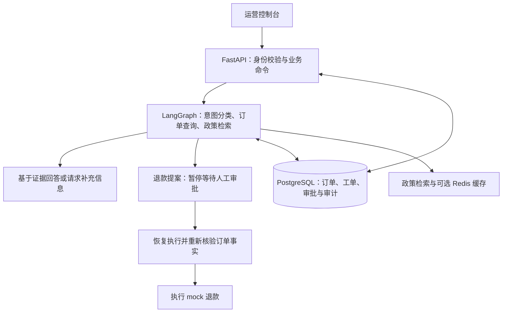

# TicketPilot

[English](README.md) | 简体中文

面向多租户售后场景的 AI 工单系统，支持订单查询、政策检索和人工退款审批。系统由 React 运营控制台、LangGraph 工作流与 PostgreSQL 业务状态管理组成。

`React · TypeScript · FastAPI · LangGraph · PostgreSQL · Redis · Docker Compose`

## 核心功能

| 功能 | 实际行为 |
| --- | --- |
| 订单与物流查询 | 根据租户范围内的订单事实回答，运单信息脱敏展示 |
| 政策检索 | 检索适用条款并附带引用，支持 BM25、向量、混合检索与重排 |
| 多轮信息补充 | 跨消息补齐订单或退款信息 |
| 退款审批 | 暂停等待人工决定，恢复后重新核验订单，再执行 mock 退款 |
| 租户与角色隔离 | 按租户、客户所有权和角色约束读写，越权资源统一返回 404 |
| 幂等执行 | 区分重试与新的退款动作，并发重试复用原工单与运行记录 |
| 运营控制台 | 展示工单、审批、处理结果、执行事件与业务统计 |
| 检索缓存 | 可选 Redis 缓存，按租户与版本隔离，故障时回退到直接检索 |

## 处理流程


```mermaid
flowchart TD
    UI["运营控制台"] --> API["FastAPI：身份校验与业务命令"]
    API --> G["LangGraph：意图分类、订单查询、政策检索"]
    G --> R["基于证据回答或请求补充信息"]
    G --> A["退款提案：暂停等待人工审批"]
    A --> V["恢复执行并重新核验订单事实"]
    V --> F["执行 mock 退款"]
    API <--> DB[("PostgreSQL：订单、工单、审批与审计")]
    G <--> DB
    G --> C["政策检索与可选 Redis 缓存"]
```

工单状态与处理结果分别记录，证据不足、依赖故障、等待补充信息和完成回答具有明确的结果语义。

## 功能展示

真实模型运行中的订单查询：展示物流事实、政策引用与处理进度。


## 验证结果

| 验证场景 | 结果 |
| --- | --- |
| 合成历史数据加载 | 12 个租户、1,000,000 条订单、共 3,246,760 条关联记录；21 项跨表检查通过 |
| 并发重试 | 100 次相同创建只产生一个工单与 run；100 次相同审批只执行一次 mock 退款 |
| HTTP 只读查询 | 5,000/5,000 请求成功；本地并发 20 时峰值约 199 requests/s |
| 中文意图与字段抽取 | 120 条诊断集四字段严格匹配 101/120，84.17% |
| 定向 schema 回归 | 独立 45 条回归集严格匹配 44/45，97.78% |
| 自动化检查 | 默认 Python：325 passed、44 skipped；PostgreSQL：147 passed；前端：4 项测试通过 |

模型评测使用 `qwen3.7-flash`，意图、订单号、金额与全额退款标志全部匹配才算正确。45 条结果属于定向回归，不代表修复后的 120 条总分。HTTP 只读测试不包含模型调用与写操作；不同测试集合存在重叠，不能相加。

## 快速开始

需要 Docker Compose。复制环境模板后，在 `.env` 添加 `TICKETPILOT_RETRIEVAL_STRATEGY=bm25`，即可使用无需下载向量模型的检索方式。

```sh
cp .env.example .env
docker compose -f compose.yaml -f docker/compose.ticketpilot-demo.yaml up -d --build
```

- 运营控制台：<http://localhost:3000>
- API 健康检查：<http://localhost:8080/health>
- 售后工作台：<http://localhost:8501>

默认演示使用确定性 reasoner 和合成订单，无需模型 API key，退款为 mock 操作。真实模型配置见 [`.env.example`](.env.example)。

## 验证方式

```sh
uv sync --frozen --extra retrieval
uv run pytest
uv run pytest tests/ticketpilot --run-docker
uv run python scripts/ticketpilot_demo.py
```

PostgreSQL 与 API 检查需要演示栈运行。GitHub Actions 同时覆盖 Python 3.12–3.14、类型、格式、前端构建、Docker 集成与 HTTPS 演示认证。

## 实现与许可证

TicketPilot 基于 MIT 许可的 [agent-service-toolkit](https://github.com/JoshuaC215/agent-service-toolkit)，在服务与 checkpoint 基础上增加了工单工作流、租户范围内的业务仓储、审批控制、幂等、检索与运营控制台。原始版权声明保留在 [LICENSE](LICENSE)。
