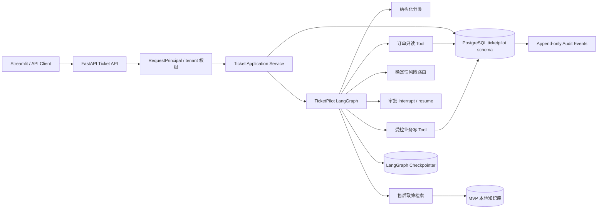
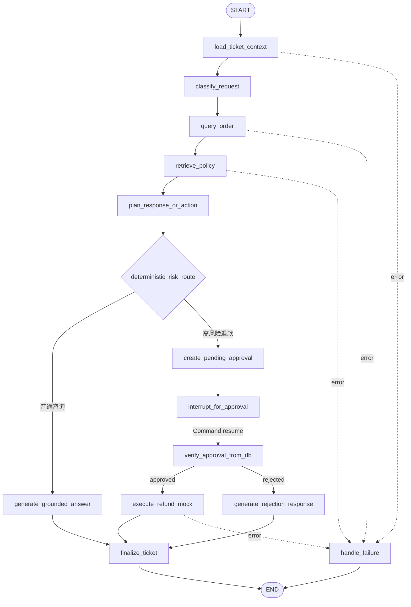
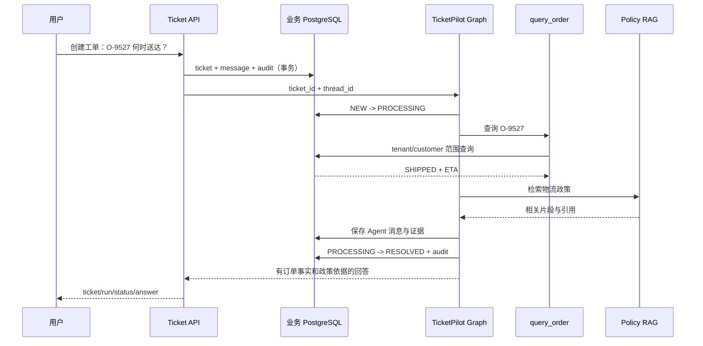
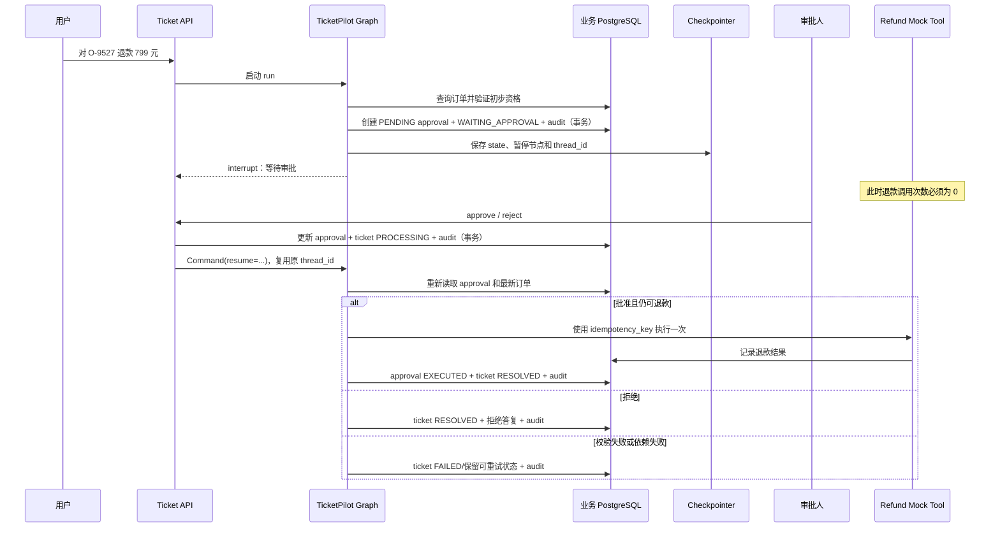

# TicketPilot MVP 架构设计

> 状态：Day 6–7 设计基线；MVP、M1 加固（P0-A～D、P1-A）、M2 评测与演示工作台已实现，最新验证证据见 [README](../README.zh-CN.md)
>
> 适用范围：TicketPilot 第一版业务 MVP 及其可靠性加固
>
> 本文描述目标设计与不变量；实现进度、提交归属与仍未实现的边界以 [`CONTRIBUTION_MAP.md`](CONTRIBUTION_MAP.md) 为准。

## 1. 目标与验收边界

TicketPilot 是基于
[`agent-service-toolkit`](https://github.com/JoshuaC215/agent-service-toolkit)
二次开发的企业售后工单 Agent。MVP 只验证两条完整业务链路：

1. 普通订单咨询：查询 Mock 订单与售后政策，生成有事实依据的回答；
2. 高风险退款：生成退款方案，暂停等待人工审批，审批后恢复并幂等执行。

MVP 的完成标准不是“模型能聊天”，而是同时满足：

- 订单事实来自业务数据源，不能由模型编造；
- 工单状态可查询并遵守允许的状态迁移；
- 高风险退款在批准前绝不执行；
- 服务重启后可从 checkpoint 恢复；
- 重试或重复审批不会造成重复退款；
- 每个关键动作都有 tenant、actor、run 和结果审计证据；
- 普通咨询和退款审批都有 API、工具与 graph 层测试。

贡献归属见 [`CONTRIBUTION_MAP.md`](CONTRIBUTION_MAP.md)。
数据来源、许可、转换和盲测隔离见 [`DATASET_STRATEGY.md`](DATASET_STRATEGY.md)。

## 2. 架构原则

### 2.1 模型只负责判断和生成，不拥有业务权限

模型可以：

- 从消息中提取订单号和意图；
- 输出结构化分类结果；
- 根据订单事实和政策片段生成处理建议；
- 提出需要执行的业务动作。

模型不能：

- 自己决定可信的 `tenant_id`、`user_id` 或角色；
- 直接执行任意 SQL；
- 绕过审批调用高风险写工具；
- 直接修改工单、审批或审计记录；
- 把生成内容当作订单事实。

权限、状态迁移、审批校验、幂等和数据库写入都由确定性 Python 代码执行。

### 2.2 业务事实与 Agent 执行状态分离

```text
PostgreSQL public schema
└── LangGraph 基础设施表
    ├── checkpoints
    ├── checkpoint_blobs
    ├── checkpoint_writes
    └── store

PostgreSQL ticketpilot schema
└── TicketPilot 业务表
    ├── orders
    ├── tickets
    ├── ticket_messages
    ├── approvals
    └── audit_events
```

MVP 复用一个 PostgreSQL 实例和数据库，但通过逻辑 schema 与连接职责分开：

- LangGraph saver/store 继续维护 `public` 中的内部表；
- TicketPilot repository 使用独立的业务连接池访问 `ticketpilot` schema；
- graph state 只保存执行上下文、业务对象 ID 和中间判断；
- `ticketpilot` 业务表是订单、工单、审批和审计事实的唯一权威来源。

不允许从 checkpoint 反向推导正式审批结果或订单状态。

### 2.3 先使用可复现的 Mock 订单源

MVP 不连接淘宝、京东、支付平台或真实企业数据。`orders` 表保存经过构造的本地测试订单，
通过 `OrderRepository` 抽象访问：

```text
query_order Tool
    -> OrderRepository
        -> PostgresOrderRepository（MVP）
        -> ExternalOrderAPIAdapter（未来可替换）
```

Agent 和 Tool 只依赖 `OrderRepository` 合同，不依赖底层是 PostgreSQL 还是外部 HTTP API。

## 3. 总体组件图



现有 FastAPI、Agent 注册、SSE 和 PostgreSQL saver/store 继续复用：

- [`src/service/service.py`](../src/service/service.py)
- [`src/agents/agents.py`](../src/agents/agents.py)
- [`src/memory/postgres.py`](../src/memory/postgres.py)

TicketPilot 领域路由、业务连接池、repository、graph 和 Tool 属于个人新增范围。

## 4. 标识符与作用域

| 标识符 | 含义 | 生命周期 | 来源 |
| --- | --- | --- | --- |
| `tenant_id` | 数据归属的企业租户 | 长期 | 从可信认证上下文取得，禁止模型或请求正文指定 |
| `customer_id` | 工单关联客户 | 长期 | 认证上下文或经过授权的客服操作 |
| `ticket_id` | 一张正式业务工单 | 工单生命周期 | TicketPilot 创建 |
| `order_pk` | 订单在 TicketPilot 数据库中的内部 UUID | 订单生命周期 | TicketPilot 数据库 |
| `order_reference` | 用户可见的租户内订单编号，如 `O-9527` | 订单生命周期 | Mock 订单源或未来外部系统 |
| `thread_id` | LangGraph 会话与 checkpoint 作用域 | 一张工单的 Agent 对话 | TicketPilot 创建并绑定到 `ticket_id` |
| `run_id` | 一次模型/graph 执行尝试 | 单次请求或 resume | 服务端创建 |
| `approval_id` | 一次高风险动作审批 | 审批生命周期 | TicketPilot 创建 |
| `idempotency_key` | 防止相同业务动作重复执行 | 一个写操作 | 客户端或服务端生成并受唯一约束保护 |

MVP 采用“一张 ticket 对应一个稳定 `thread_id`”。同一 ticket 可以有多个 `run_id`：

```text
ticket_id T-1001
└── thread_id TH-1001
    ├── run_id R-1：创建并分类
    ├── run_id R-2：用户追加消息
    └── run_id R-3：审批后恢复
```

## 5. 六种工单业务状态与六种处理结果

工单状态描述工单当前处于哪个生命周期阶段：

| 状态 | 准确定义 |
| --- | --- |
| `NEW` | 工单和初始消息已经持久化，Agent 尚未开始有效处理 |
| `PROCESSING` | Agent 正在分类、查询、检索、生成建议或执行已授权动作 |
| `WAITING_APPROVAL` | 已创建待审批的高风险动作，Agent 在 checkpoint 中暂停 |
| `WAITING_INFORMATION` | 缺少订单号、退款金额等必要信息，等待用户补充 |
| `RESOLVED` | 本轮业务目标已经完成，且没有待审批动作 |
| `FAILED` | 当前处理因不可恢复错误终止，需要显式重试或人工处理 |

`processing_result` 描述最近一次 run 的业务结果，不等同于“代码执行完了”：

| 结果 | 含义 |
| --- | --- |
| `ANSWERED` | 已基于现有业务事实或证据完成回答／动作 |
| `NEEDS_INPUT` | 缺少用户可补充的必要信息 |
| `WAITING_APPROVAL` | 已形成高风险动作提案，等待人工决定 |
| `DEPENDENCY_FAILED` | 必需的订单或政策依赖暂时不可用 |
| `INSUFFICIENT_EVIDENCE` | 检索成功但没有足够证据支持回答 |
| `PROCESSING_FAILED` | 未归入前述类别的执行异常或安全阻断 |

数据库约束确保 `RESOLVED` 只能对应 `ANSWERED`，`WAITING_INFORMATION` 只能对应 `NEEDS_INPUT`；`NEW/PROCESSING` 的结果为空。分类也不是工单状态，分类结果保存在以下字段和审计事件中：

```text
category
priority
risk_level
triaged_at
TICKET_TRIAGED audit event
```

### 5.1 允许的状态迁移

| 当前状态 | 下一状态 | 触发条件 |
| --- | --- | --- |
| `NEW` | `PROCESSING` | 初始事务已提交，graph 开始运行 |
| `PROCESSING` | `WAITING_APPROVAL` | 已在同一事务创建 `PENDING` approval，并准备 interrupt |
| `PROCESSING` | `WAITING_INFORMATION` | 缺少可由用户补充的必要字段 |
| `PROCESSING` | `RESOLVED` | 普通咨询已生成有依据的答复，或已授权动作成功完成 |
| `PROCESSING` | `FAILED` | 错误已分类且重试预算耗尽，或出现不可恢复错误 |
| `WAITING_APPROVAL` | `PROCESSING` | 审批决定已提交，graph 使用原 `thread_id` 恢复 |
| `WAITING_INFORMATION` | `PROCESSING` | 用户补充消息并启动新 run |
| `FAILED` | `PROCESSING` | 授权人员显式重试或用户追加了可继续处理的信息 |
| `RESOLVED` | `PROCESSING` | 用户追加新问题，工单重新打开 |

禁止模型输出一个字符串就直接修改状态。所有迁移由应用服务调用统一状态机验证。

### 5.2 状态不变量

- `WAITING_APPROVAL` 必须至少关联一个该 ticket 的 `PENDING` approval；
- 存在 `PENDING` approval 时，相关高风险写工具调用次数必须为 0；
- 进入 `RESOLVED` 时不能存在 `PENDING` approval；
- `approval.status = APPROVED` 不等于动作已经执行，执行结果必须另有审计事件；
- 每次状态迁移必须写入 `audit_events`；
- 状态更新必须检查当前版本或当前状态，禁止无条件覆盖并发修改。

## 6. 五张业务表

以下是逻辑数据模型。具体 DDL、索引和迁移脚本在 Day 8 实现并通过测试验证。

### 6.1 `ticketpilot.orders`

Mock 订单事实，也是未来外部订单 Adapter 的本地替身。

| 字段 | 类型建议 | 约束或用途 |
| --- | --- | --- |
| `id` | UUID | 主键，内部引用 |
| `tenant_id` | text/UUID | 必填，租户隔离 |
| `order_reference` | text | 必填，租户内可见订单号 |
| `customer_id` | text/UUID | 必填，订单所有者 |
| `payment_status` | text | `PAID/REFUNDED/CANCELLED` 等确定值 |
| `fulfillment_status` | text | `PENDING/SHIPPED/DELIVERED/CANCELLED` 等确定值 |
| `paid_amount` | numeric(12,2) | 禁止 float |
| `currency` | char(3) | MVP 默认 `CNY` |
| `refundable_amount` | numeric(12,2) | 退款资格计算依据 |
| `carrier` | text nullable | 物流公司 |
| `tracking_number` | text nullable | 物流号，API 按权限脱敏 |
| `estimated_delivery_at` | timestamptz nullable | 预计送达时间 |
| `version` | integer | 乐观并发控制 |
| `created_at/updated_at` | timestamptz | 审计时间 |

唯一约束：`UNIQUE (tenant_id, order_reference)`。

### 6.2 `ticketpilot.tickets`

工单业务事实的主表。

| 字段 | 类型建议 | 约束或用途 |
| --- | --- | --- |
| `id` | UUID | `ticket_id` 主键 |
| `tenant_id` | text/UUID | 必填，租户隔离 |
| `customer_id` | text/UUID | 必填 |
| `order_pk` | UUID nullable | 指向 `orders.id` |
| `thread_id` | text/UUID | 必填且唯一，绑定 LangGraph checkpoint |
| `status` | text | 六种工单生命周期状态之一 |
| `processing_result` | text nullable | 最近一次 run 的业务结果；运行中为空 |
| `category` | text nullable | 如 `ORDER_STATUS/REFUND/POLICY/OTHER` |
| `priority` | text nullable | `LOW/NORMAL/HIGH/URGENT` |
| `risk_level` | text nullable | `READ_ONLY/LOW_RISK_WRITE/HIGH_RISK_WRITE` |
| `subject` | text | 工单标题 |
| `resolution_summary` | text nullable | 处理完成摘要，不替代消息历史 |
| `triaged_at/resolved_at` | timestamptz nullable | 关键业务时间 |
| `version` | integer | 状态迁移的乐观并发控制 |
| `created_at/updated_at` | timestamptz | 审计时间 |

所有查询必须同时带 `tenant_id` 和 `id`，不能只按 `ticket_id` 读取。

### 6.3 `ticketpilot.ticket_messages`

保存用户、客服和 Agent 对用户可见的业务消息。LangGraph 内部 ToolMessage 不自动复制到这里。

| 字段 | 类型建议 | 约束或用途 |
| --- | --- | --- |
| `id` | UUID | 主键 |
| `tenant_id` | text/UUID | 必填 |
| `ticket_id` | UUID | 必填，指向 ticket |
| `run_id` | UUID nullable | 产生或消费该消息的执行 |
| `role` | text | `CUSTOMER/AGENT/STAFF` |
| `content` | text | 用户可见正文 |
| `citations` | JSONB | 政策引用或结构化证据，默认空数组 |
| `idempotency_key` | text nullable | 追加消息的重试键；初始消息为空，追加消息在 ticket 内唯一 |
| `created_at` | timestamptz | 创建时间 |

消息正文不能作为审批决定或订单事实的唯一来源。

### 6.4 `ticketpilot.approvals`

保存高风险动作的正式审批事实。

| 字段 | 类型建议 | 约束或用途 |
| --- | --- | --- |
| `id` | UUID | `approval_id` 主键 |
| `tenant_id` | text/UUID | 必填 |
| `ticket_id` | UUID | 必填，指向 ticket |
| `run_id` | UUID | 提出动作的 run |
| `action_type` | text | MVP 为 `REFUND` |
| `action_payload` | JSONB | 金额、币种、order ID 等不可变提案快照 |
| `status` | text | `PENDING/APPROVED/REJECTED/EXECUTED/CANCELLED` |
| `requested_by` | text | `AGENT` 或发起 actor |
| `decided_by` | text nullable | 可信审批人 ID |
| `decision_reason` | text nullable | 审批理由 |
| `idempotency_key` | text | 防止重复创建或执行相同动作 |
| `requested_at/decided_at/executed_at` | timestamptz nullable | 生命周期时间 |

唯一约束至少包括：`UNIQUE (tenant_id, idempotency_key)`。

### 6.5 `ticketpilot.audit_events`

追加写、不可就地修改的业务审计流。

| 字段 | 类型建议 | 约束或用途 |
| --- | --- | --- |
| `id` | UUID 或 bigserial | 主键及稳定排序 |
| `tenant_id` | text/UUID | 必填 |
| `ticket_id` | UUID nullable | 关联工单 |
| `run_id` | UUID nullable | 关联执行 |
| `approval_id` | UUID nullable | 关联审批 |
| `actor_type` | text | `CUSTOMER/AGENT/STAFF/SYSTEM` |
| `actor_id` | text nullable | 具体主体 |
| `event_type` | text | 如 `TICKET_CREATED/TOOL_SUCCEEDED/APPROVAL_DECIDED` |
| `node_name/tool_name` | text nullable | graph 或 Tool 证据 |
| `outcome` | text | `STARTED/SUCCEEDED/FAILED/BLOCKED` |
| `details` | JSONB | 脱敏后的参数摘要、错误分类和耗时 |
| `occurred_at` | timestamptz | 事件时间 |

禁止在 `details` 中保存 API key、完整支付凭据或不必要的个人信息。

## 7. 五个业务 API

所有 API 都先解析 `RequestPrincipal`。`tenant_id`、可信 `user_id` 和角色来自认证依赖，
不得从请求正文直接采信。

### 7.1 `POST /v1/tickets`

创建工单、初始消息并启动第一次 Agent run。

请求必须携带 `Idempotency-Key`。其作用域是 tenant 和可信调用主体，而不是请求正文中的身份字段。

请求核心字段：

```json
{
  "subject": "查询订单物流",
  "message": "订单 O-9527 什么时候送到？",
  "order_reference": "O-9527"
}
```

行为：

1. 对规范化后的请求正文计算摘要；同 key 同摘要返回原 ticket/run，同 key 不同摘要返回 409；
2. 一个数据库事务内创建 ticket、initial message 和 `TICKET_CREATED` 事件；
3. 提交后启动 graph；
4. graph 运行到 `RESOLVED`、`WAITING_APPROVAL` 或 `FAILED`；
5. 返回 `ticket_id`、`thread_id`、`run_id`、状态和最新答复。

`order_reference` 可以省略并由模型尝试提取，但真正查询仍需通过授权 Tool。

### 7.2 `POST /v1/tickets/{ticket_id}/messages`

向已有工单追加消息并启动新 run。MVP 返回同步 JSON；TicketPilot 专用 SSE 的事件合同、断线恢复和去重留到 Week 3。

关键要求：

- 请求必须携带 `Idempotency-Key`；
- HTTP 重试复用原 key；新的用户意图使用新 key，并生成新的 message/run；
- 先验证 ticket 属于当前 tenant/customer 或当前客服有访问权限；
- `RESOLVED` 或 `FAILED` 工单收到合法新消息后可转回 `PROCESSING`；
- 不能用普通消息接口伪造审批决定。

### 7.3 `GET /v1/tickets/{ticket_id}`

返回当前租户内的工单详情：

```text
status/category/priority/risk_level
关联订单的允许展示字段
用户可见消息
当前 pending approval 摘要
引用证据
关键时间
```

禁止仅凭知道 `ticket_id` 就读取其他 tenant 的资源。

### 7.4 `POST /v1/approvals/{approval_id}:decide`

由具有审批角色的主体批准或拒绝高风险动作。

请求核心字段：

```json
{
  "decision": "APPROVE",
  "reason": "订单符合退款政策"
}
```

行为：

1. 验证 tenant、角色、approval 状态及 ticket 归属；
2. 使用条件更新把 `PENDING` 原子地改为 `APPROVED` 或 `REJECTED`；
3. 同一事务将 ticket 从 `WAITING_APPROVAL` 改为 `PROCESSING`，并写入
   `APPROVAL_DECIDED` 事件；
4. 事务提交后，使用 ticket 的原 `thread_id` 执行 `Command(resume=...)`；
5. resume 后再次从业务数据库读取 approval，不能只相信 Command payload。

退款提案以触发消息 ID 作为 `action_id`。同一动作在节点重放时只能复用原审批；即使订单、金额和币种完全相同，只要来自新的用户消息，就是新的业务动作，可以创建新的审批。

重复提交同一个决定应返回原结果；冲突决定返回 `409 CONFLICT`，不能覆盖第一次决定。

### 7.5 `GET /v1/runs/{run_id}/events`

按时间顺序返回当前 tenant 可见的审计事件，用于解释：

- 运行经过哪些 graph 节点；
- 模型选择了什么 Tool；
- Tool 是否成功、耗时多少；
- 为什么进入人工审批；
- 失败属于模型、检索、工具、权限还是基础设施问题。

该接口读取 `audit_events`，不直接暴露原始 checkpoint 内部结构。

## 8. Tool/受控操作合同与权限分级

| Tool | 风险等级 | 输入来源 | 是否需要审批 |
| --- | --- | --- | --- |
| `query_order` | `READ_ONLY` | 模型提取 `order_reference`，tenant/customer 由运行时注入 | 否 |
| `search_policy` | `READ_ONLY` | 用户问题和已知订单上下文 | 否 |
| `update_ticket_summary` | `LOW_RISK_WRITE` | 结构化处理结果 | 否，但必须审计 |
| `request_refund_approval` | `LOW_RISK_WRITE` | 退款提案 | 创建审批，不执行退款 |
| `execute_refund_mock` 受控节点 | `HIGH_RISK_WRITE` | graph 从数据库读取 approval，不接受模型直接调用 | 是，且必须幂等 |

### 8.1 `query_order` 输出合同

```json
{
  "found": true,
  "order_reference": "O-9527",
  "payment_status": "PAID",
  "fulfillment_status": "SHIPPED",
  "paid_amount": "799.00",
  "currency": "CNY",
  "carrier": "SF Express",
  "tracking_number_masked": "SF****3456",
  "estimated_delivery_at": "2026-09-08T18:00:00+08:00"
}
```

Tool 内部从运行时上下文获取 `tenant_id` 和 actor，不允许模型自行提供这两个可信字段。

### 8.2 高风险 Tool 的执行门

`execute_refund_mock` 执行前必须全部满足：

```text
approval 存在
AND approval.tenant_id == 当前 tenant
AND approval.ticket_id == 当前 ticket
AND approval.status == APPROVED
AND approval.action_payload 与本次动作完全一致
AND 订单当前仍可退款
AND idempotency_key 尚未成功执行
```

任一条件不满足都必须阻断并写审计事件。

## 9. TicketPilot Graph

### 9.1 建议 Graph State

```python
class TicketAgentState(MessagesState, total=False):
    ticket_id: str
    order_reference: str | None
    category: str | None
    priority: str | None
    risk_level: str | None
    order_snapshot: dict | None
    policy_evidence: list[dict]
    proposed_action: dict | None
    approval_id: str | None
    error_code: str | None
```

`order_snapshot` 只用于本次推理和回答，恢复高风险动作前必须根据
`order_reference` 重新查询业务源。

### 9.2 节点与边



风险路由必须是确定性代码：模型输出结构化提案，但“退款属于高风险写操作”由服务端规则决定。

## 10. 两条冻结的 MVP 流程

### 10.1 普通订单咨询



验收断言：

- 不存在的订单返回明确的 `ORDER_NOT_FOUND`，模型不得补造订单；
- 其他 tenant 的订单表现为不可访问，不泄漏是否存在；
- 最终回答中的物流状态与数据库记录一致；
- RAG 不可用时可以回答订单事实，但必须说明政策依据暂不可用，不能伪造引用。

### 10.2 高风险退款审批



验收断言：

- 审批前 `execute_refund_mock` 调用次数为 0；
- 使用不同 tenant 或无审批角色决定审批时返回 `403` 或 `404`；
- 服务在 interrupt 后重启，仍能用原 `thread_id` 恢复；
- 同一审批和幂等键重复提交不会执行第二次退款；
- 修改后的订单若已不可退款，即使旧审批为 `APPROVED` 也必须阻断。

## 11. 事务、恢复与一致性

### 11.1 关键事务边界

以下操作分别要求数据库原子性：

1. 创建 ticket、初始 message、`TICKET_CREATED` audit event；
2. 创建 pending approval、ticket 转 `WAITING_APPROVAL`、写审计；
3. 决定 approval、ticket 转回 `PROCESSING`、记录审批人和理由、写审计；
4. 幂等执行退款结果、approval 转 `EXECUTED`、ticket 转 `RESOLVED`、写审计。

模型调用和外部 Tool 调用不应长时间占用数据库事务。

### 11.2 数据库提交与 checkpoint 之间不能假装强事务

业务 PostgreSQL 写入与 LangGraph checkpoint 保存不是同一个原子事务。MVP 通过以下方式处理间隙：

- 所有写操作有幂等键；
- graph state 只保存业务 ID，不把未提交数据视为成功；
- 恢复节点总是重新读取业务事实；
- 审计事件记录 `STARTED/SUCCEEDED/FAILED`；
- 重试以业务表中的最终结果为准，而不是以节点是否执行过为准。

## 12. 身份、tenant 与最小 RBAC

定义运行时主体：

```python
class RequestPrincipal:
    tenant_id: str
    actor_id: str
    role: Literal["CUSTOMER", "AGENT", "STAFF", "APPROVER", "ADMIN"]
```

MVP 本地环境可以用服务端配置的开发 Token 映射主体；测试通过 FastAPI dependency override 注入主体。
未来可以替换为 JWT/OIDC，但业务层只依赖 `RequestPrincipal`。

最小权限：

| 动作 | CUSTOMER | STAFF | APPROVER | ADMIN |
| --- | ---: | ---: | ---: | ---: |
| 创建自己的工单 | 是 | 是 | 否 | 是 |
| 查看自己的工单 | 是 | 是（租户内） | 审批相关 | 是 |
| 查询订单 | 自己的订单 | 租户内授权订单 | 审批相关 | 是 |
| 决定高风险审批 | 否 | 否 | 是 | 是 |
| 查看完整审计 | 仅用户可见摘要 | 是 | 是 | 是 |

当前上游把 `user_id` 作为客户端可提交字段，该方式不能作为 TicketPilot 的可信权限依据。

## 13. 错误分类与 API 语义

| 错误码 | HTTP | 含义 |
| --- | ---: | --- |
| `VALIDATION_ERROR` | 422 | Schema 或字段格式错误 |
| `UNAUTHORIZED` | 401 | 未提供有效身份 |
| `FORBIDDEN` | 403 | 主体已认证但角色不允许该动作 |
| `RESOURCE_NOT_FOUND` | 404 | 当前 tenant 范围内资源不存在或不可见 |
| `STATE_CONFLICT` | 409 | 非法状态迁移、审批已决定或并发版本冲突 |
| `IDEMPOTENCY_CONFLICT` | 409 | 同一幂等键对应不同请求 |
| `DEPENDENCY_TIMEOUT` | 503 | 订单源、RAG 或其他依赖超时 |
| `AGENT_EXECUTION_FAILED` | 500 | 已分类但无法安全恢复的 Agent 错误 |

错误响应不返回数据库连接串、Prompt、堆栈、API key 或其他 tenant 的存在性信息。

## 14. RAG 的 MVP 边界

当前上游 RAG 使用本地 Chroma 和通用员工手册：

- [`src/agents/rag_assistant.py`](../src/agents/rag_assistant.py)
- [`src/agents/tools.py`](../src/agents/tools.py)

Day 8–14 先准备小型、可复现的售后政策文档与固定引用，不把向量数据库迁移作为业务 MVP
的阻塞条件。Week 3 再比较 chunk、embedding、hybrid retrieval、rerank，并评估将知识文档迁入
PostgreSQL + pgvector。

订单、工单、审批和审计数据永远不依赖向量检索作为权威查询方式。

## 15. 建议代码边界

后续实现优先保持模块边界清楚，不把所有业务逻辑继续堆入现有 `service.py`：

```text
src/ticketpilot/
├── api.py                 # 五个业务 API
├── schemas.py             # Pydantic 领域合同
├── domain.py              # 状态、枚举和业务规则
├── db.py                  # 业务连接池和事务入口
├── repositories.py        # ticket/order/approval/audit 数据访问
├── services.py            # 用例编排、权限和状态迁移
├── tools.py               # 受控 Tool 合同
└── graph.py               # TicketPilot LangGraph

migrations/
└── ticketpilot/           # 可重复执行的业务 schema 迁移
```

这是逻辑边界，Day 8 实现时可以按文件规模进一步拆包，但不改变职责划分。

## 16. Day 8–14 实施顺序

| Day | 实施内容 | 当日验收 |
| --- | --- | --- |
| 8 | Pydantic Schema、五种状态、五张表及迁移（已完成） | Schema、约束和迁移测试通过 |
| 9 | `POST/GET /v1/tickets` 与 tenant 资源归属（已完成数据/API 骨架） | 创建、查询、越权和错误测试通过；graph 启动留到 Day 11 |
| 10 | `query_order`、政策检索和 Mock 数据（已完成） | Tool 成功、未找到、越权、超时测试通过 |
| 11 | 分类、订单查询、风险路由 graph（已完成） | 普通咨询走到 `RESOLVED`，退款走到审批分支 |
| 12 | approval API、interrupt/resume、退款幂等（已完成） | 审批前零执行，批准后一次执行，重启可恢复 |
| 13 | audit events 与 Streamlit 最小展示（已完成） | 两条链路均可查看关键事件和状态 |
| 14 | E2E、失败用例和演示整理（已完成） | 两条主链路可连续重复演示 |

## 17. MVP 冻结清单

进入 Day 8 前，以下内容视为冻结：

- 六种 ticket 状态：`NEW/PROCESSING/WAITING_APPROVAL/WAITING_INFORMATION/RESOLVED/FAILED`；
- 五张业务表：`orders/tickets/ticket_messages/approvals/audit_events`；
- 五个业务 API；
- 一个稳定 `thread_id` 绑定一张 ticket；
- 订单数据源为 PostgreSQL Mock repository；
- 普通订单咨询和高风险退款审批两条主链路；
- tenant 从可信运行时上下文注入；
- 高风险退款必须经过数据库审批记录、恢复后复验和幂等执行；
- Checkpoint 不作为业务数据库；
- RAG 升级、pgvector、Redis、Kafka、Kubernetes 和真实支付不进入 MVP。

如果后续实现需要改变以上边界，先修改 ADR 并说明原因，再调整代码。

启动、演示脚本与自动化验收见 [`TICKETPILOT_DEMO.md`](TICKETPILOT_DEMO.md)；按阶段的实现记录见
[`CONTRIBUTION_MAP.md`](CONTRIBUTION_MAP.md) 第 9–14 节。
